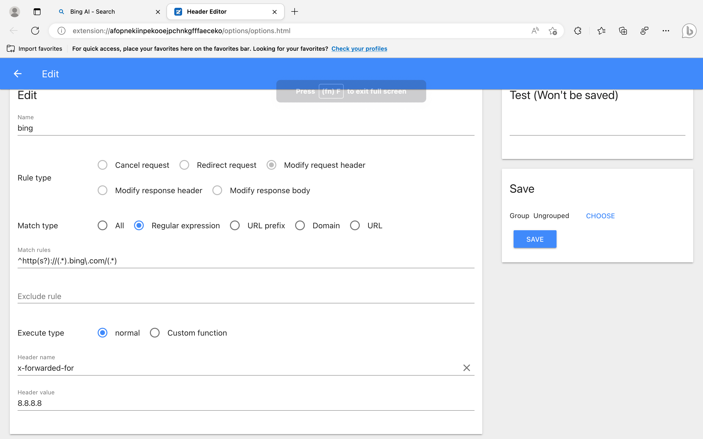
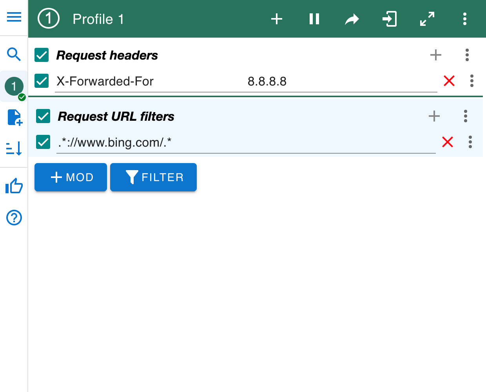

## Edge Dev进bing.com找不到chat按钮，右上角按钮也没有chat功能

**解决**：

### 1.用插件

插件管理：网址栏右边拼图状图标->Extensions

#### 1.1 Header Editor

#### 1.1 Mod Header

### 2.清除浏览器缓存

右上角三点->Settings->左边Cookies and Site Permission->右边上面Manage and delete cookies and site data->See all cookies and site data->搜索bing.com->删除bing.com的所有cookies

Created On : 2023-03-13
Last Modified : 2023-03-13