## Learning Git Branch通关指南（[链接](https://learngitbranching.js.org)）

# 基础篇

1. Git Commit

   「提交」保存目录下所有文件快照，「提交记录」可以看作整个项目的快照（轻量级，非全盘复制）

   

   每次「提交」时只把所有的差异打包到一起作为一个「提交记录」

   

   Git 还保存了提交的历史记录，因此每个「提交记录」（图中的一个节点）上都有父节点

   

   修改代码库后，使用`git commit`，在当前所处的「提交记录」下创建新的「提交记录」（向下生成一个子节点），并移动到该节点上。

   

   通关记录：（初始状态：C0，C1（main*））

   

   

   

2. Git Branch

   Git的「分支」指向某个提交记录。

   

   「分支」非常轻量，创建再多的分支也不会造成储存或内存上的开销，并且按逻辑分解工作到不同的分支要比维护那些特别臃肿的分支简单多了。

   

   因此提倡「早建分支！多用分支！」

   

   使用「分支」相当于“基于这个提交以及它所有的父提交进行新的工作”。

   

   使用`git branch branch_name`创建新分支，但默认HEAD还在原来main分支上，此时commit会使main分支前进，新分支待在原地。

   

   使用`git checkout branch_name`切换到新分支上。（新版本Git使用git switch代替git checkout）

   

   创建新分支的同时切换到新分支上：`git checkout -b branch_name`

   

   通关记录：（初始状态：C0，C1（main*））

   

   

   

3. Git Merge

   创建新分支，在其上开发某个新功能，开发完成后再合并回主线。

   

   使用`git merge branch_name`（其中branch_name是要合并到当前分支的分支名）「合并」两个分支。

   

   此时会产生一个特殊的提交记录，它有两个父节点。相当于“把这两个父节点本身及它们所有的祖先都包含进来。”

   

   

   

   如果要「合并」的分支是当前分支的父节点，Git 什么都不用做，只是把那个分支移动到当前分支所指的提交记录上。

   

   

   

   通关记录：（初始状态：C0，C1（main*））

   

   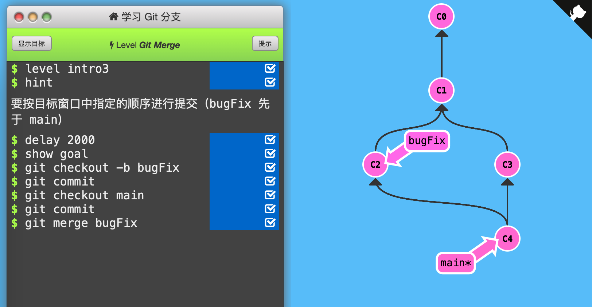

   

   

4. Git Rebase

   Rebase是另一个合并分支的方法：取出一系列的提交记录，“复制”它们，然后在另外一个地方逐个的放下去。

   

   Rebase 的优势就是可以创造更「线性」的提交历史。

   

   使用`git rebase branch_name`（其中branch_name是当前分支要合并“去”的分支名）「合并」两个分支。

   

   此时当前分支原来所在的提交记录依然存在（C3），但当前分支已经移动到rebase的分支（main）的子节点去了。然而rebase的分支还没有更新。

   

   如果有多个分支，则创建新提交记录接在下面；如果分支已经是最新版本，则是将分支指向目标提交记录。

   

   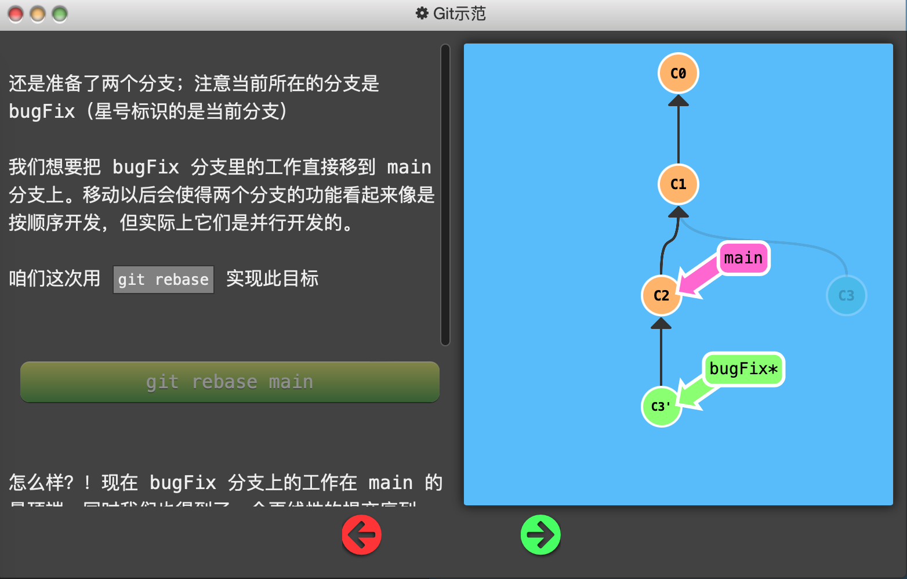

   

   如果要「rebase」的分支是当前分支的子节点，Git 什么都不用做，只是把当前分支移动到那个分支所指的提交记录上。

   

   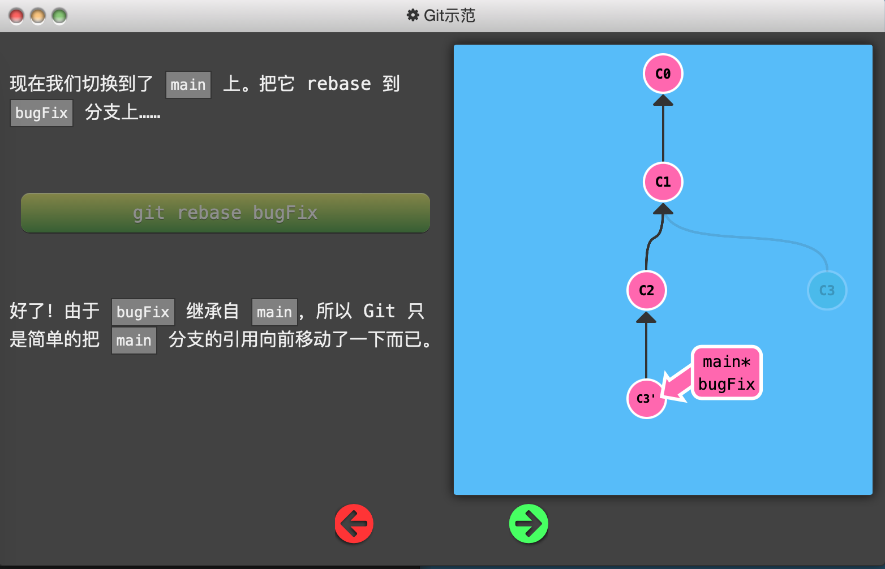

   通关记录：（初始状态：C0，C1（main*））

   
   
   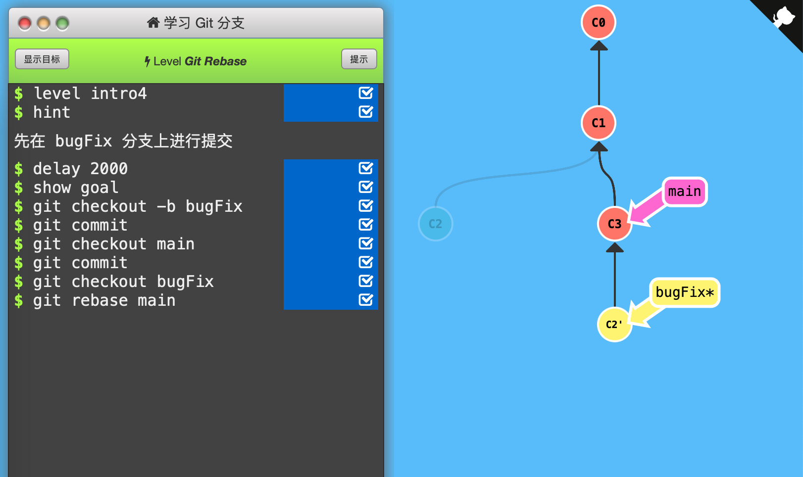
   
   

# 高级篇

1. 分离HEAD

   「HEAD」 是一个对当前所在分支的符号引用。「HEAD」总是指向当前分支上最近一次提交记录。

   

   「HEAD」 通常情况下是指向分支名的（如 bugFix）。在你提交时，改变了 bugFix 的状态，这一变化通过 「HEAD」 变得可见。

   

   「分离的 HEAD」 就是让其指向了某个具体的提交记录而不是分支名。

   

   注：图中C1、C2等是提交记录的哈希值，现实中不会这么简洁地呈现。但`git checkout <hash_code>`命令确实有用。

   

   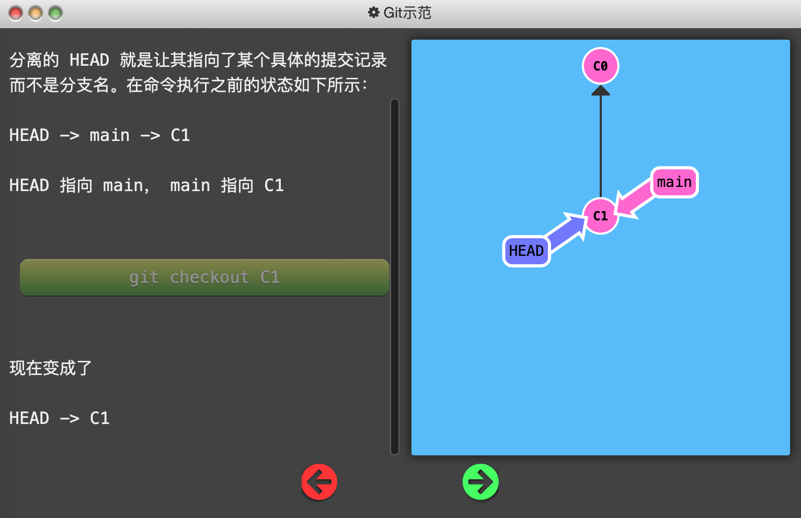

   

   我的理解：HEAD是Git中一个重要的指针，它可以指向分支名（而分支名指向一个提交记录），也可以指向提交记录。通常图中的\*号就表示当前HEAD所指的分支名，没有\*号则HEAD必然指向某个提交记录。也可以理解成：HEAD是隐藏分支名，如果不分离，则与另一个分支名重合。

   

   通关记录：（初始状态：当前所在分支为bugFix（后面有*号），HEAD没有显示出来）

   

   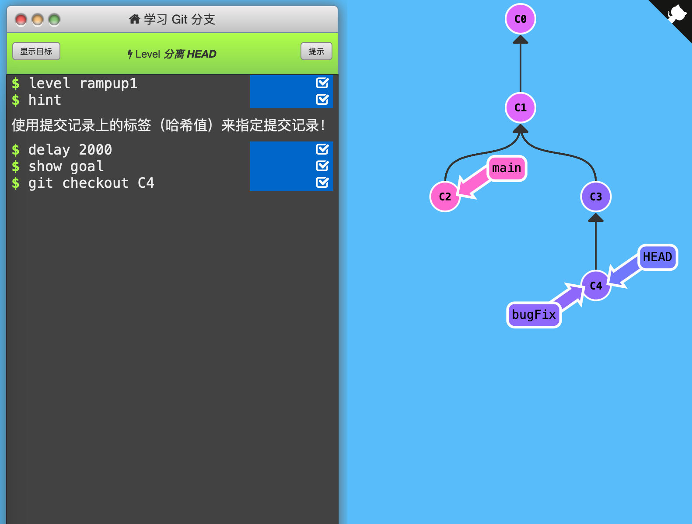

   

2. 相对引用（^）

   如上一节所说，C1、C2等是提交记录的「哈希值」，现实中的「哈希值」可能是：

   `fed2da64c0efc5293610bdd892f82a58e8cbc5d8`

   

   提交记录的「哈希值」可以使用`git log`命令查看。

   

   但是，Git 对哈希值的处理很智能。只需要提供能够唯一标识提交记录的前几个字符即可。如`fed2`即可识别上面的哈希值。

   

   使用「哈希值」指定提交记录很不方便。因此使用相对引用：

   - 使用 `^` 向上移动 1 个提交记录
   - 使用 `~<num>` 向上移动多个提交记录，如 `~3`

   将上面的符号加在「引用名称」的后面，来寻找提交记录的祖先节点。

   

   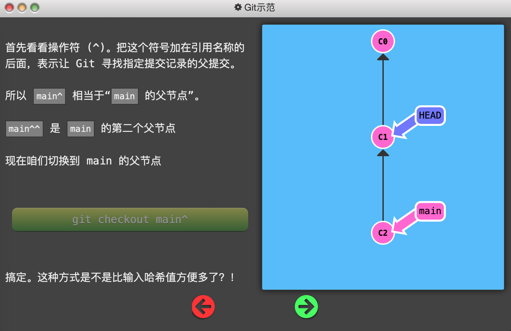

   

   

   

   通关记录：（初始状态：*号在main后面，HEAD没有显示）

   

   

   

   

3. 相对引用2（~）

   - 如上一节所说，使用 `~<num>` 可以向上移动多个提交记录。

   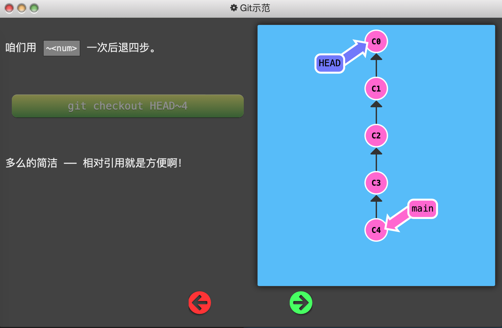

   - 强制修改分支位置：直接使用 `-f` 选项让分支（而不必是HEAD）指向另一个提交。（下图中，初始时main指向C4）

   

   

   通关记录：（初始状态：main指向C4，bugFix指向C5，HEAD指向C2）

   

   依次使用「强制修改分支位置」移动main和bugFix、使用「~相对引用」移动HEAD

   

   

   

4. 撤销变更

   - 使用`git reset`命令向上移动分支，实现「改写历史」。

   

   - 使用`git revert`命令将撤销后指向的提交记录生成新的提交记录，添加在当前分支上。这样可以将「撤销更改」推送到远程仓库。

   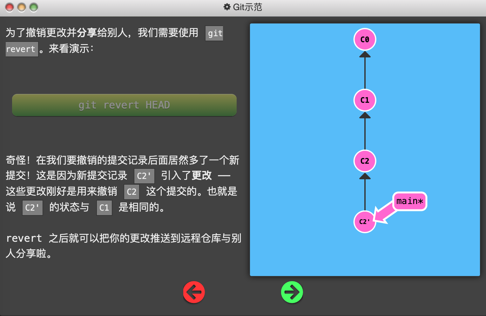

   

   通关记录：（初始状态：local*指向C3，pushed指向C2）

   

   依次使用`git reset`撤销「HEAD所指」的local分支，使之指向C1；使用`git checkout`将HEAD指向pushed分支；使用`git revert`撤销pushed分支，生成与C1内容相同的C2'提交记录。（注意，revert前先分离HEAD至pushed，才能在C2下面生成新提交记录）

   

   

   

# 移动提交记录

1. Git Cherry-pick

   本节内容讲如何「整理提交记录」，即操控之前那些节点。

   

   `git cherry-pick <提交号>...`命令将一些提交「复制」到当前所在位置「HEAD」的下面。

   

   下图初始状态：C2'和C4'都没有，main*指向C5。

   

   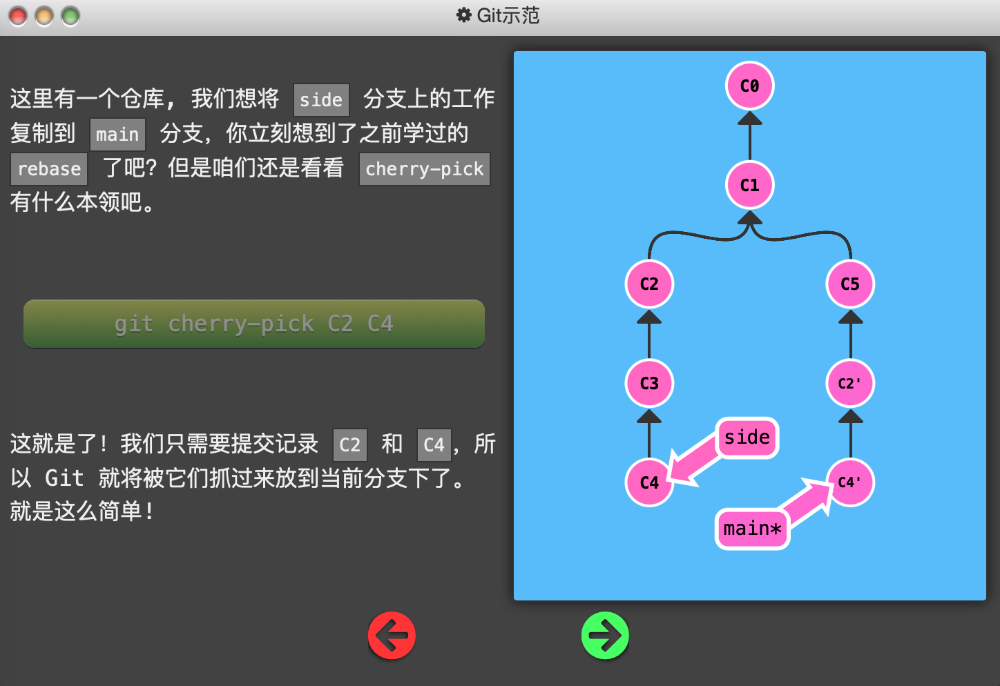

   

   对比`git rebase <branch_name>`命令，rebase是将当前所在位置复制一份，并加到到目标分支下面，且当前所在位置移动过去了。而`git cherry-pick`仅仅复制了「提交记录」到当前所在位置的下面，并移动了HEAD到最新提交记录。

   

   通关记录：（初始状态：main*指向C1，C3'、C4'、C7'不存在）

   

   用`git cherry-pick`将3个提交记录复制添加到main*下面即可。注意该命令后可跟多个提交记录，会依次按顺序添加。

   

   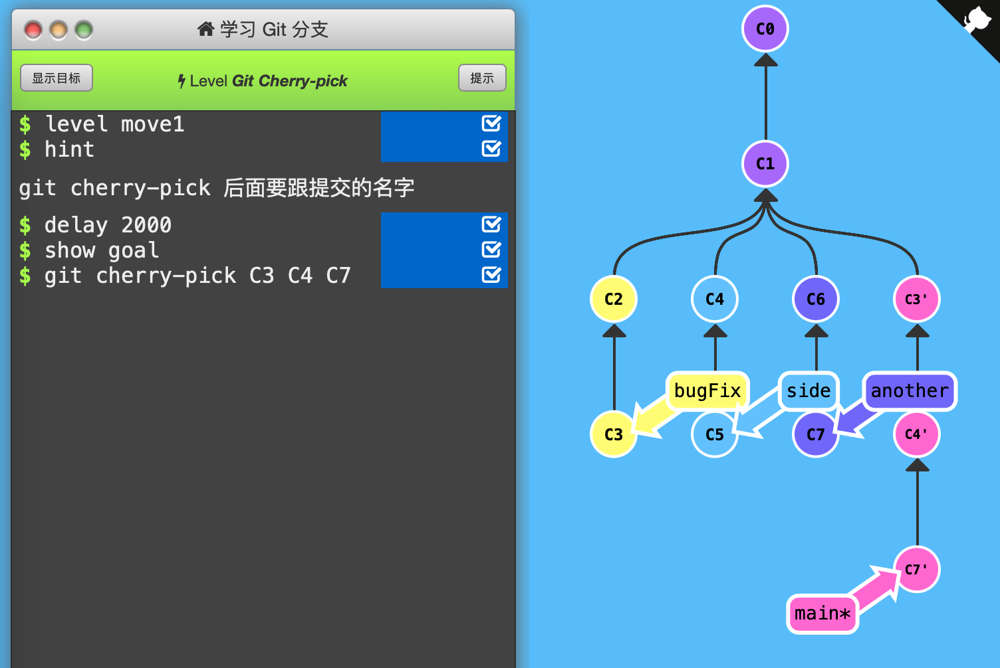

   

2. 交互式rebase

   `git cherry-pick`虽然好用，但如果不知道提交记录的哈希值，就不那么方便了。因此需要使用交互式rebase从一系列的提交记录中找到想要的记录。

   

   交互式rebase即使用带参数 `--interactive` 的 rebase 命令, 简写为 `-i`。Git 会打开一个 UI 界面（一般是Vim）并列出将要被复制到目标分支的备选提交记录，它还会显示每个提交记录的哈希值和提交说明。

   

   下图初始状态：main*指向C5，右边这一列带'的提交记录都不存在。在课程给出的面板中可以调整C2\~C5节点的顺序、是否加入，最后会按照该顺序rebase到HEAD\~4即C1下面。

   

   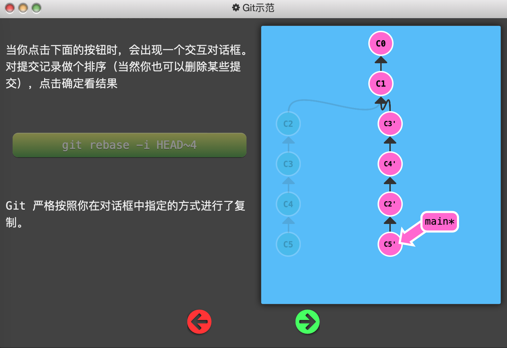

   

   通关记录：（初始状态：和上面的初始状态一样。）

   

   使用`git rebase -i HEAD~4`进入交互式rebase界面，并指定rebase的目标节点为C1。然后根据要求调整节点数量和顺序为C3、C5、C4即可。

   

   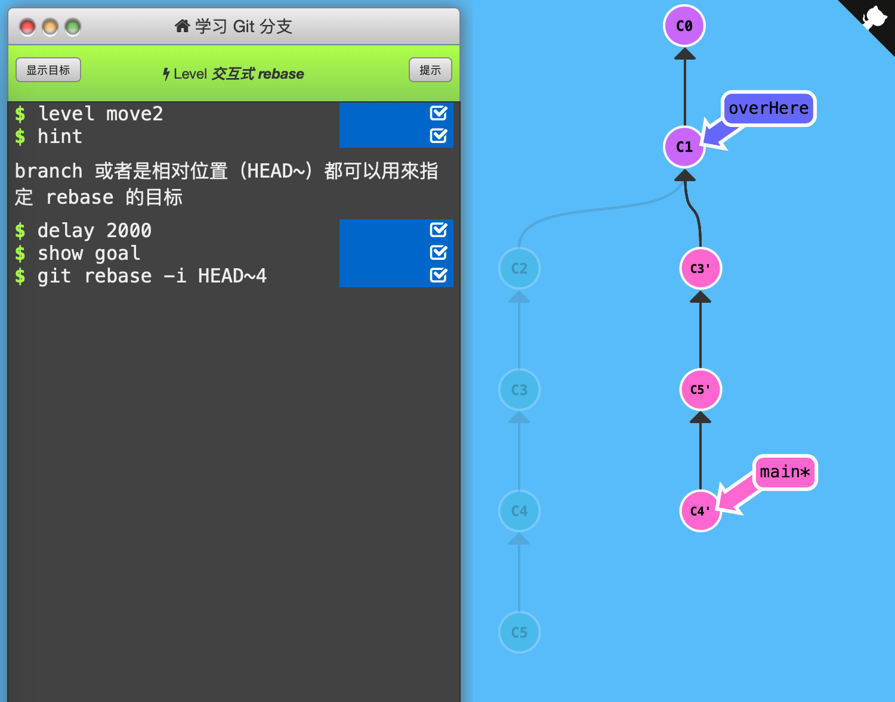

   
   
   

# 杂项

1. 只取一个提交记录

   通关记录：（初始状态：C1 main，C2 debug，C3 printf， C4 bugFix\*，本关只检查main\*的位置）

   

   法1:HEAD转移到main上，再用cherry-pick把bugFix复制到main*下。

   

   

   

   法2:交互式rebase将bugFix到main的C2~C4三个提交记录指定只保留C4，并接在main下面，再用rebase将main移动到bugFix并指定为HEAD所在处。

   

   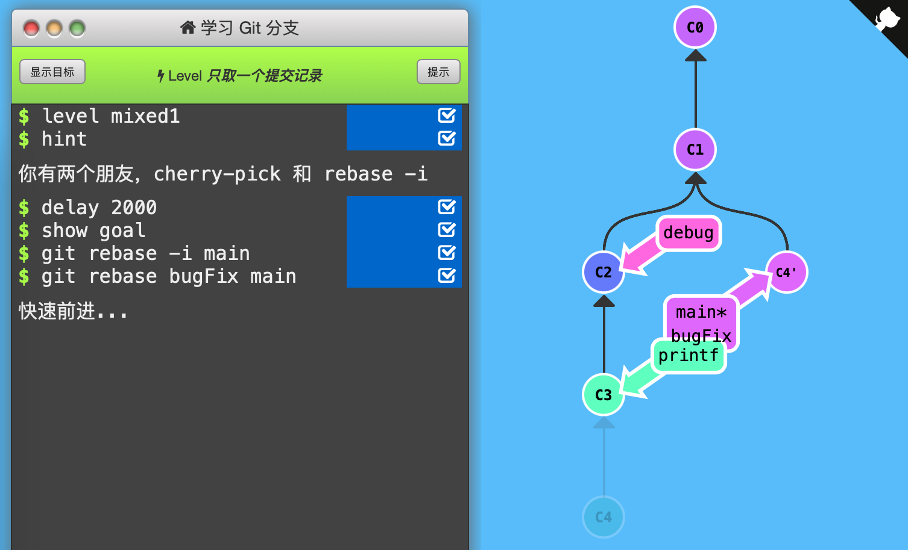

   

2. 提交的技巧 #1

   本节解决一种情况：希望在某个分支的旧版本上作修改，如有C1-C2-C3，希望修改C2，又要保留C3的修改。

   

   方法：`git rebase -i`重新排序提交记录，把希望修改的提交记录放在最前面用`git commit --amend`修改（这样新的提交记录是平行的，而不是在下面新添加），再用`git rebase -i`排序回来，最后把main分支移动到最新版本。

   

   通关记录：（初始状态：C1 main，C2 newImage，C3 caption，本关只检查main\*的位置）

   

   思路：

   首先`git rebase -i HEAD~2`，交换C2、C3位置，作为新提交记录添加在C1下面，此时caption*指向C2'；

   然后`git commit --amend`平行增加新提交记录C2''；再`git rebase -i HEAD~2`交换回C2、C3位置；

   接着`git checkout main`+`git rebase caption`把main分支前进到最新版本。

   

   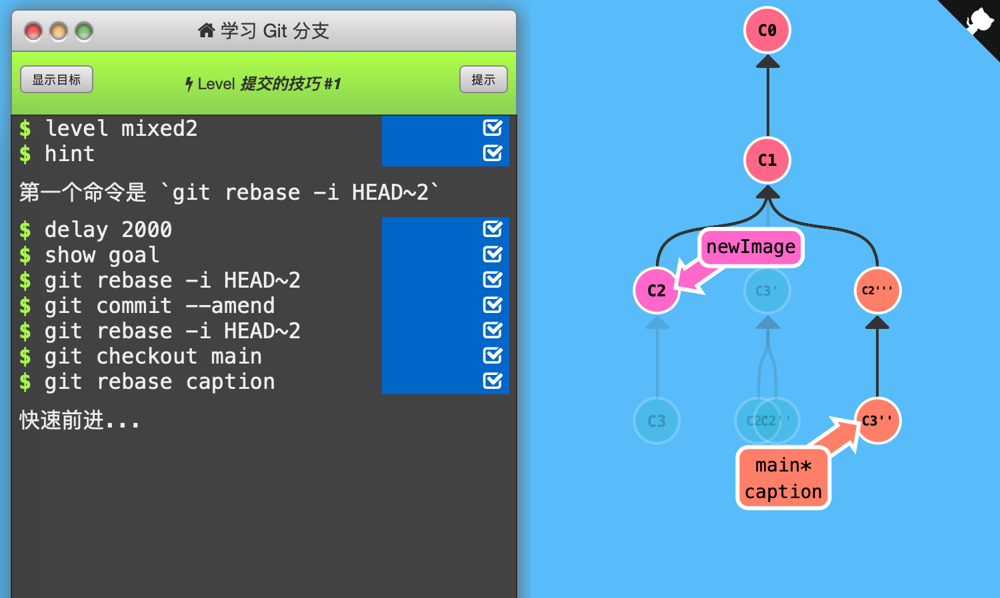

   

3. 提交的技巧 #2

   还是上面一节的问题，这次用cherry-pick解决。

   

   通关记录：（初始状态：C1 main，C2 newImage，C3 caption）

   

   思路：

   先把HEAD移动到main上；

   然后`git cherry-pick C2`取出非最新版的提交记录C2，接在main*下面；

   接着`git commit --amend`修改C2'并与其平行放置；

   最后`git cherry-pick C2`取回C2后面的修改C3 caption，接在修改完毕的C2''下面。

   

   

   

4. Git Tag

   Git的tag可以永久地将某个特定的提交命名为里程碑，然后就可以像分支一样引用了。

   

   它们并不会随着新的提交而移动。你也不能切换到某个标签上面进行修改提交，它就像是提交树上的一个锚点，标识了某个特定的位置。

   

   具体用法：`git tag v1 C1`，将标签v1贴在提交记录C1上，如果不指定提交记录，则使用HEAD所指向的位置。

   

   通关记录：（初始状态：节点无变化，各个分支指向为：C3 side，C5 main*）

   

   按照目标增添2个tag、分离HEAD到v1所在提交记录即可。

   

   

   

5. Git Describe

   Git Describe 能帮你在提交历史中移动了多次以后找到方向。

   

   用法：`git describe <ref>`，ref是任何提交记录的引用（哈希值、分支名、tag），不指定则默认为HEAD所在位置。

   

   输出：	`<tag>_<numCommits>_g<hash>`，tag是离ref最近的标签，numCommits是ref和tag相差多少个提交记录，hash表示ref的哈希值的前几位。如果ref上有标签，则只输出标签。

   

   

   

   通关记录：本关是体验关，只要在bugFix上commit一下即可过。

   

   4条语句分别测试了：

   默认describe的是HEAD所在提交记录；

   指定提交记录的哈希值；

   指定提交记录的tag；

   指定提交记录的分支名称；

   指定的提交记录如果有tag，输出tag；

   指定的提交记录没有tag，输出`<tag>_<numCommits>_g<hash>`。

   

   

# 高级话题

1. 多次Rebase

   通关记录：（初始状态：带'的节点都不存在；C2 main*，C3 bugFix，C6 side，C7 another）

   

   注意：`git rebase branch1 branch2`会将branch2到两个分支最近公共父节点之间的分支提交记录都复制并移动到branch1下，且HEAD移动到新节点上。

   

   如果两个分支的公共父节点相同（都在一个分支上，如最后的main 和another），则是将branch2指向branch1的节点，且HEAD指向branch2。

   

   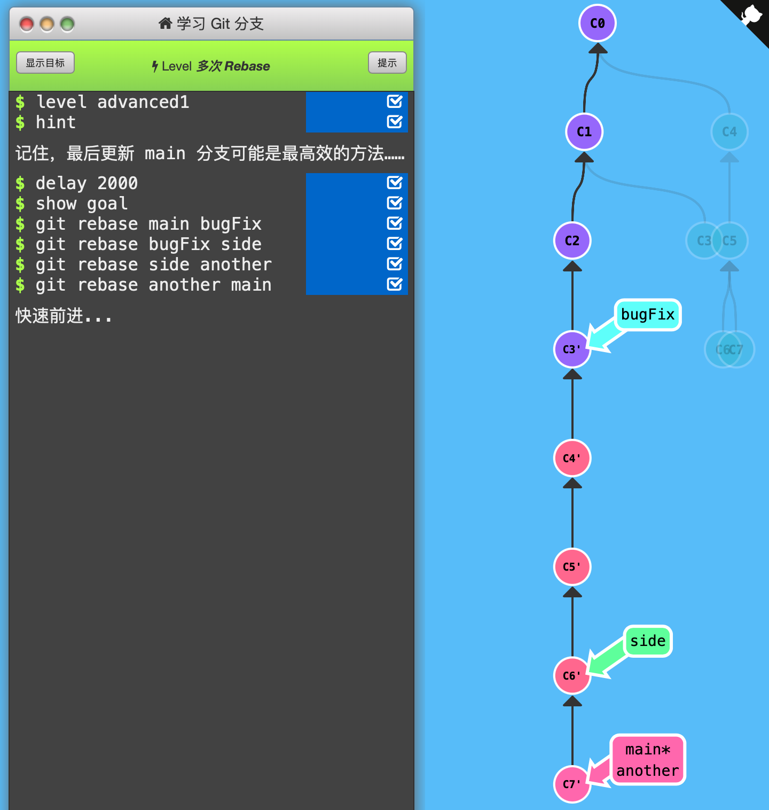

   

2. 两个父节点

   前面讲的merge会创建拥有两个父节点的新节点。因此，当在分支树中移动时需要注意移动到哪个父节点那边。^+数字可以指定移动到第几个父节点。

   

   下面的例子中，通过checkout不断移动HEAD。HEAD~n表示向上移动n次（没有n则1次），HEAD^2表示移动到第二个父节点（移动1次而不是2次）。因此，这段代码使得HEAD的移动路径为：C7-C6-C5-C3。

   

   另外，这段代码可以简写成：`git checkout HEAD~^2~2`。效果一样。

   

   

   

   通关记录：（初始状态：bugWork不存在）

   

   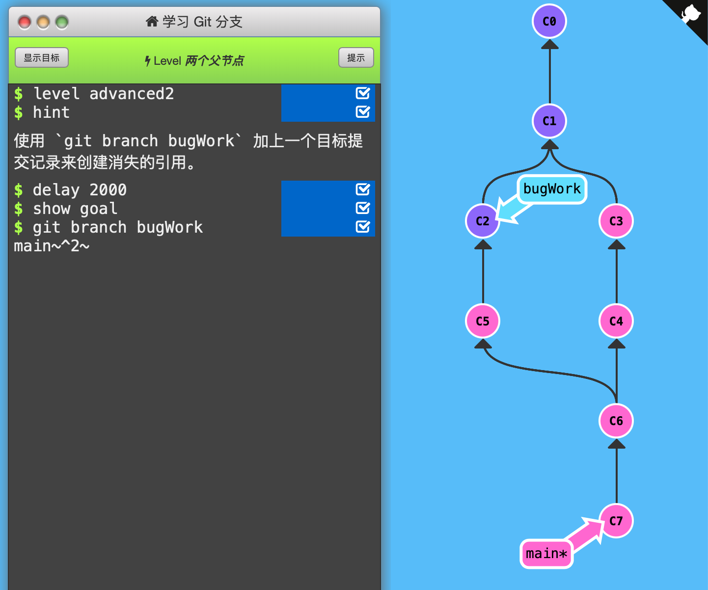

   

3. 纠缠不清的分支

   通关记录：（初始状态：带'的全都不存在；C1 one two three， C5 main*）

   

   

# Push & Pull —— Git远程仓库

1. Git Clone

   `git clone`命令将远程服务器上的仓库「克隆」到本地。通常命令后面需要指定远程仓库的SSH、HTTPS或GitHub CLI（见GitHub仓库上的Code按钮）。

   

   本课程中`git clone`命令则是将本地仓库「克隆」到远程，这跟现实相反，但其实意思差不多。

   

   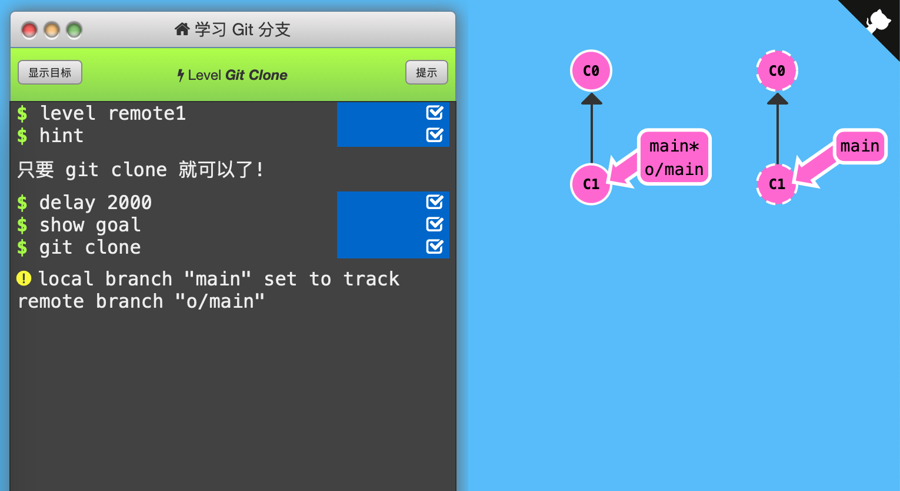

   

2. 远程分支

   `git clone`命令让本地仓库多了一个名为`o/main`的「远程分支」。远程分支反映了远程仓库(在你上次和它通信时)的**状态**。

   

   「远程分支」的命名规范：`<remote name>/<branch name>`。因此名为`o/main`的「远程分支」的含义是远程仓库`o`上的分支`main`。（一般将远程仓库命名为`origin`，这里为了简洁使用`o`）

   

   切换到远程分支时，自动进入分离 HEAD 状态。因为你不能直接在这些分支上进行操作，要在别的地方完成工作，再用远程分享工作成果。

   

   下面的例子说明了上面“切换到远程分支时，自动进入分离 HEAD 状态”和“不能直接在这些分支上进行操作”。

   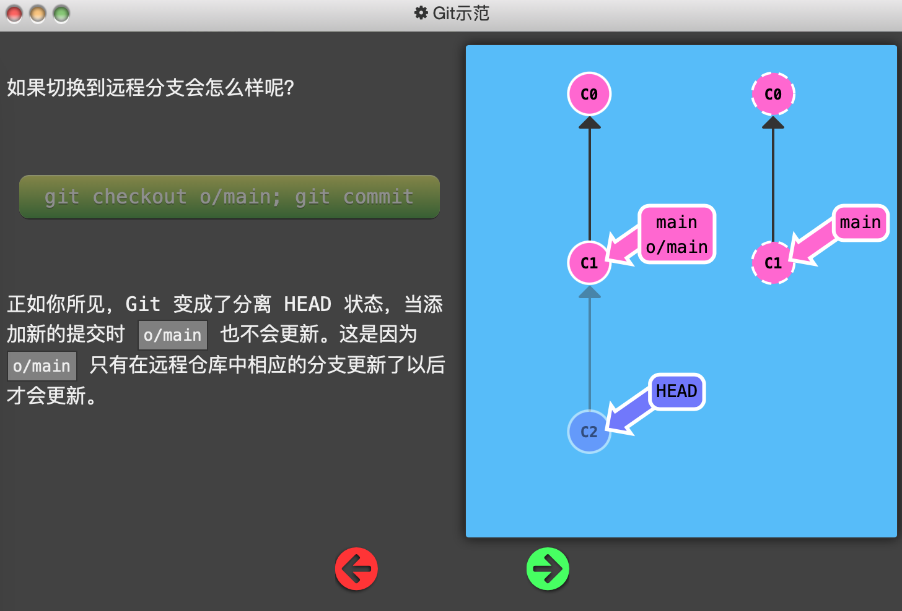

   

   通关记录：（初始状态：C1 o/main，C3 main*，右边远程仓库一样）

   

   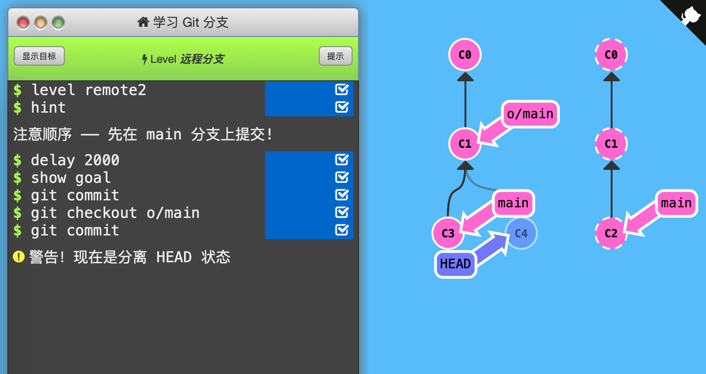

   

3. Git Fetch

   `git fetch`命令从远程仓库获取数据，同时远程分支（`o/main`）也会更新，以同步最新的远程仓库。总结来说`git fetch`：

   - 从远程仓库下载本地仓库中缺失的提交记录
   - 更新远程分支指针(如 `o/main`)到远程仓库相应分支的最新状态
   - 仅仅下载了数据，不会修改磁盘上的文件

   

   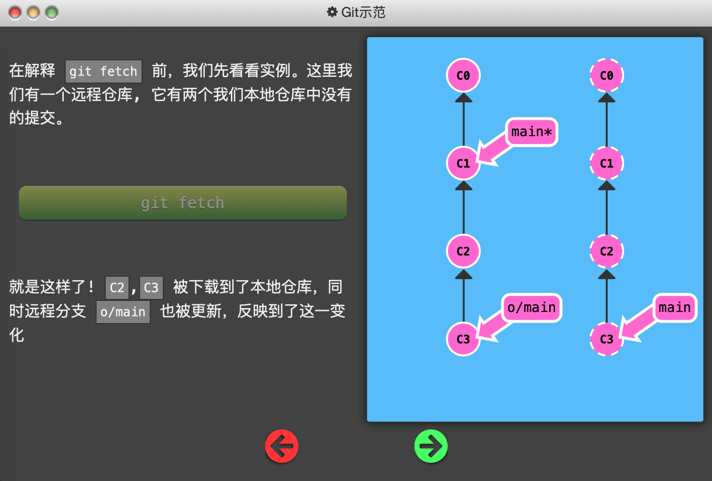

   

   通关记录：一次fetch即可，下载所有缺失的数据，并更新远程分支。

   

   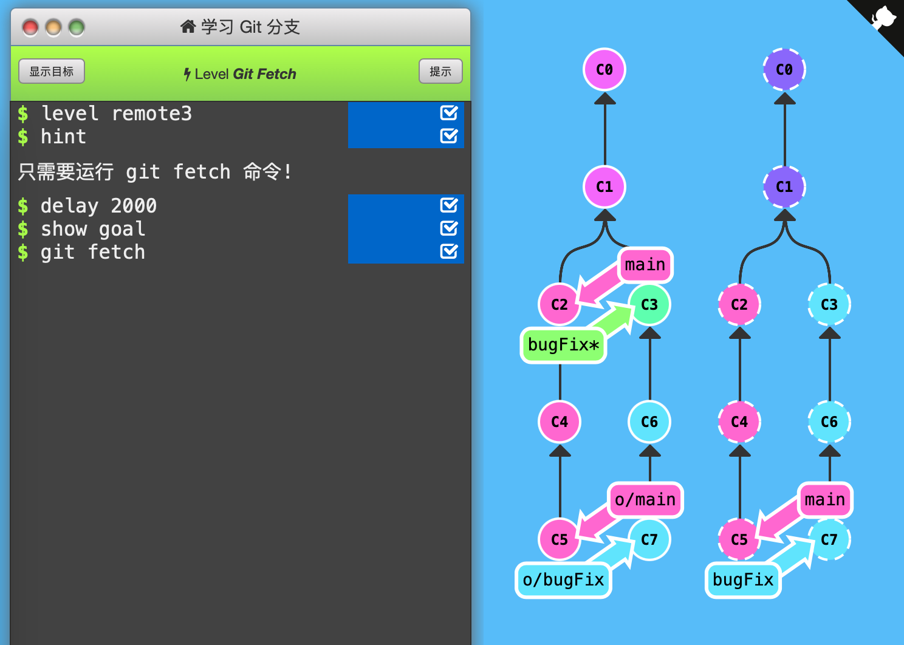

   

4. Git Pull

   ​	`git fetch`只获取了远程数据，现在要将这些改变更新到本地仓库。如，`git fetch`更新了远程分支后，我们像合并本地分支一样合并远程分支，即使用下面的命令：

   - `git cherry-pick o/main`
   - `git rebase o/main`
   - `git merge o/main`

   `git pull`命令允许我们先抓取更新，再合并到本地分支。即`git pull` = `git fetch;git merge o/main`。

   

   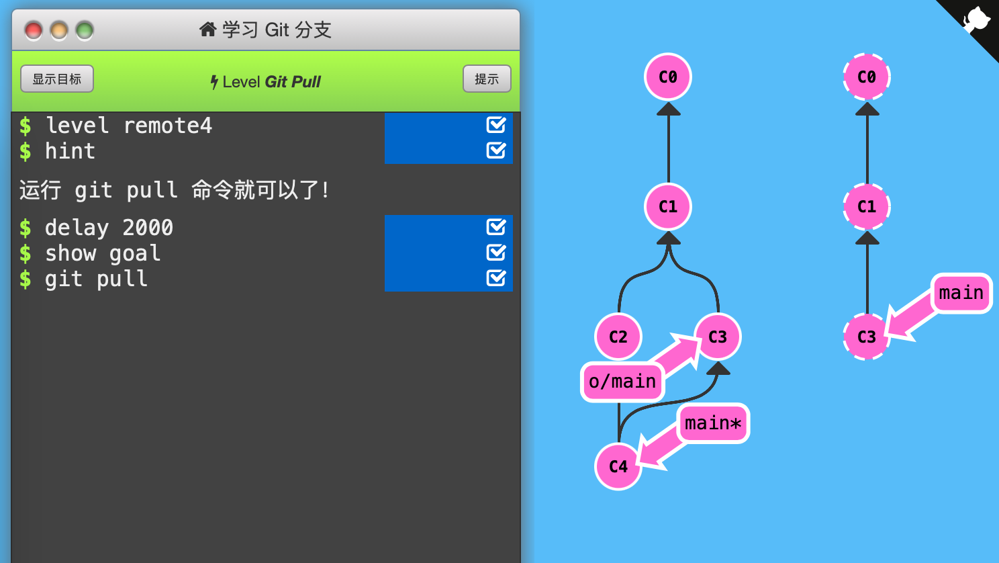

   

5. 模拟团队合作

   这节课程给出了一种不存在的命令`git fakeTeamwork`，用来模拟团队协作。这条命令可以让远程仓库的指定分支提交指定次数。

   

   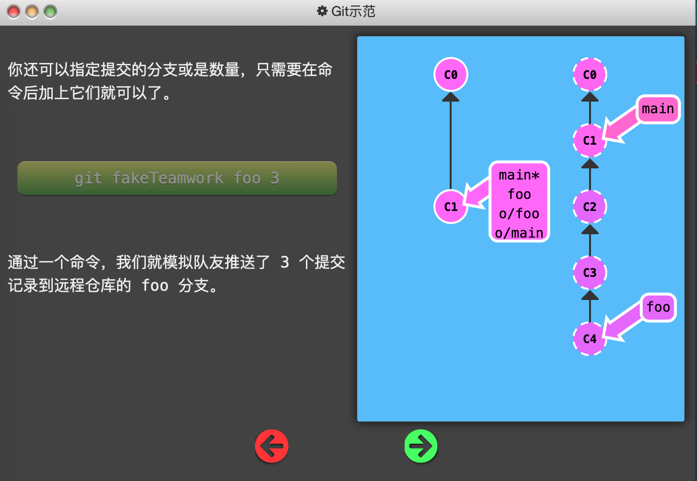

   

   通关记录：（初始状态：C0，C1 main*）

   

   注意要先`git commit`再`git pull`。如果先pull，o/main分支先更新到C3，而`git pull`是包含了`git merge o/main`的，即此时main*会跟随o/main指向C3。

   

   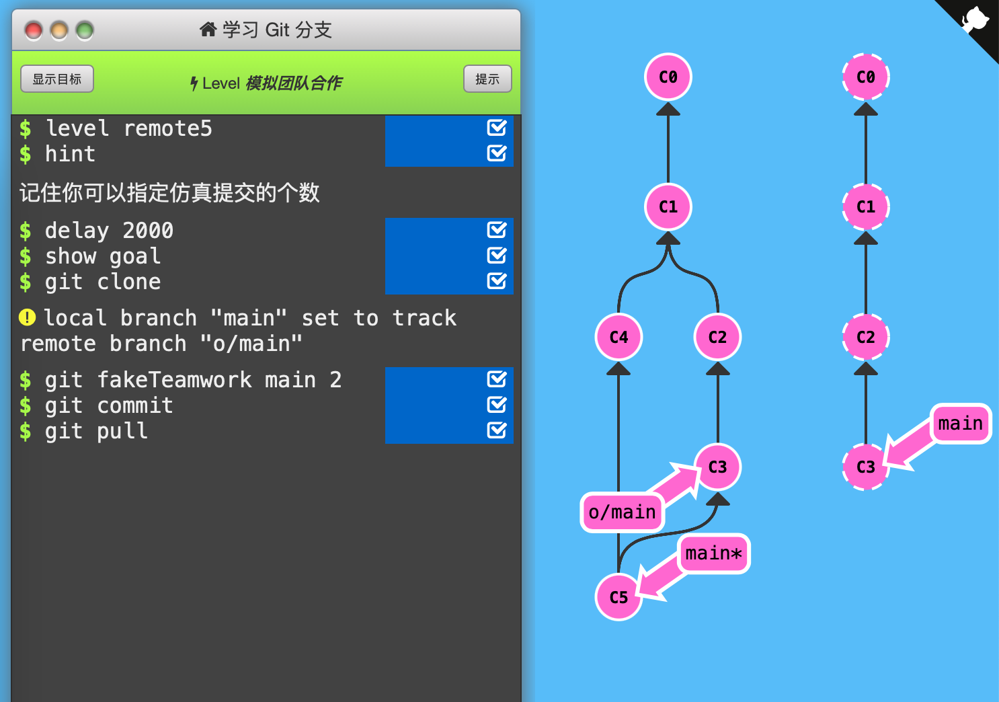

   

6. Git Push

   `git push` 负责将**你的**变更「上传」到指定的远程仓库，并在远程仓库上合并你的新提交记录。

   

   下面的例子中，初始状态为C1 o/main，C2 main\*，远程仓库C1 main，没有C2。即两边仓库的main分支状态是一样的，这可能是因为刚clone，还没有更新。但本地仓库已经更新到了C2 main\*，需要将远程仓库同步更新到C2，`git push`命令同时更新了o/main和main两个分支（和`git pull`一样）。

   

   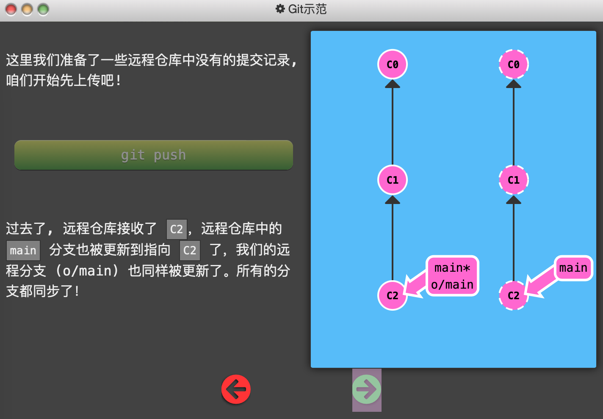

   

   通关记录：（初始状态：C0，C1 main*，o/main；远程仓库，C0，C1 main）

   

   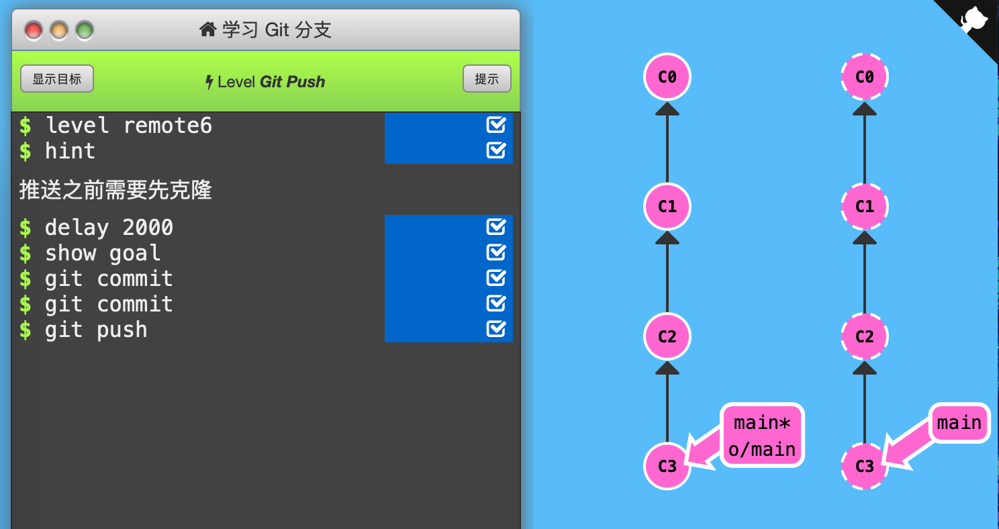

   

7. 偏离的提交历史

   先介绍提交历史的「偏离」（diverge）。你克隆了一个仓库并花费数日进行开发，但这数日内远程仓库被同事修改（重要的是改了API），导致你的工作变成基于旧版本的，与远程仓库的最新版代码不匹配。

   

   此时不能用`git push`命令变更，Git强制你先合并远程最新代码，再分享你的工作（回想每次push都要先pull并解决冲突）。

   

   下面例子中，初始状态为：C0，C1 o/main，C3 main*；远程仓库，C0，C1，C2 main。此时直接`git push`是没用的，因此远程仓库最新版和本地仓库不匹配。

   

   因此，需要先抓取远程仓库的新内容C2，再将本地分支rebase到C2下面（这一步需要解决冲突，也可以使用`git merge o/main`创建新的合并提交，反正需要先合并远程仓库的变更）成为C3'，再`git push`到远程仓库。

   

   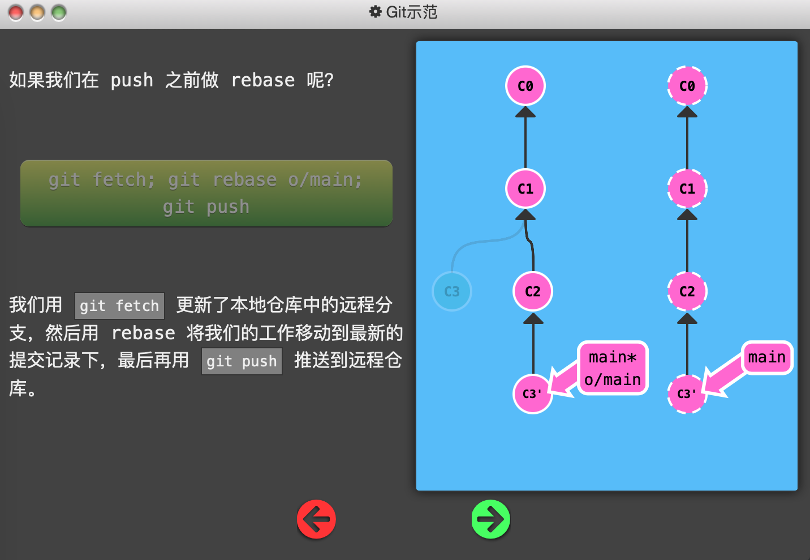

   

   前面已经介绍过 `git pull` 就是 fetch 和 merge 的简写，类似的 `git pull --rebase` 就是 fetch 和 rebase 的简写！上面的例子中命令可以简化为`git pull --rebase; git push`。如果用merge合并，则是`git pull; git push`。这也是最常用最简单的方式。

   

   通关记录：（初始状态：C0，C1 main*）

   

   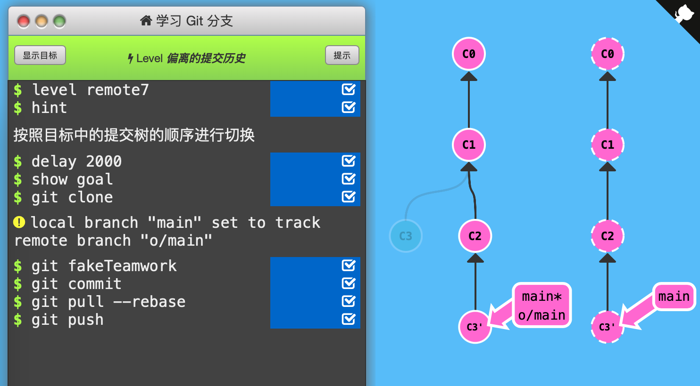

   

8. 锁定的Main（Locked Main）

   大的团队合作中，main可能被锁定，需要pull request来合并修改。如果直接commit到本地main，然后尝试push，会报错：

   

   >! [远程服务器拒绝] main -> main (TF402455: 不允许推送(push)这个分支; 你必须使用pull request来更新这个分支.)

   

   远程服务器拒绝直接push提交到main，是因为策略配置要求pull requests来提交更新（这样可以保护main分支不被太多开发者弄乱，例如Linux，不可能全球开发者都push到main上）

   

   通关记录：（初始状态：C0，C1 o/main，C2 main*；远程仓库，C0，C1 main）

   

   `git reset`可以不需要-- hard参数，该命令将main*指向了o/main。接着`git checkout -b feature C2`创建新分支feature并指向C2，且HEAD指向feature分支。接着就可以用`git push origin feature`（origin是远程仓库名字，feature是要推送分支名）将feature分支push到远程仓库了，而不需要影响远程仓库的main分支。

   

   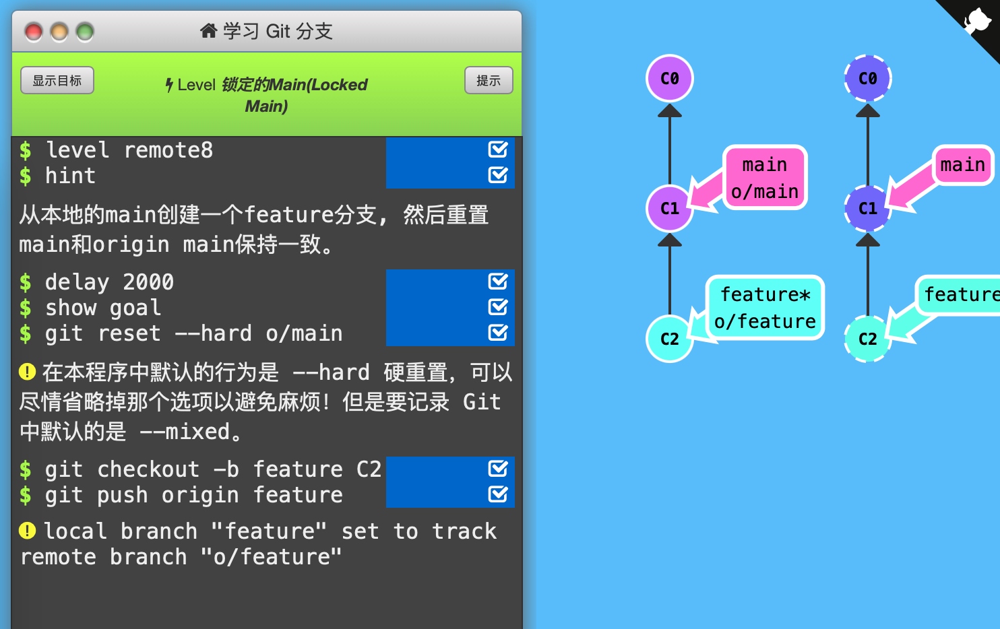

# 关于Origin和它的周边——Git远程仓库高级操作

1. 推送主分支

   通常在main分支之外的特性分支上工作，工作完成后集成到main上，然后推送并更新远程分支。

   

   下面例子的初始状态：本地有C0，C1 o/main，C2 main*；远程有C0，C1，C3 main。现在要更新main分支（从远程仓库拉取最新版本）并推送本地更新到远程。

   

   `git pull --rebase`命令将本地最新版本C2 rebase到远程分支最新的提交记录（C3），这样就完成了本地和远程更改的合并；`git pull`则向远程推送了本地的工作。

   

   本题通关需要先将远程工作合并过来，然后推送3个特性分支。

   

   通关记录：

   

   初始状态：

   

   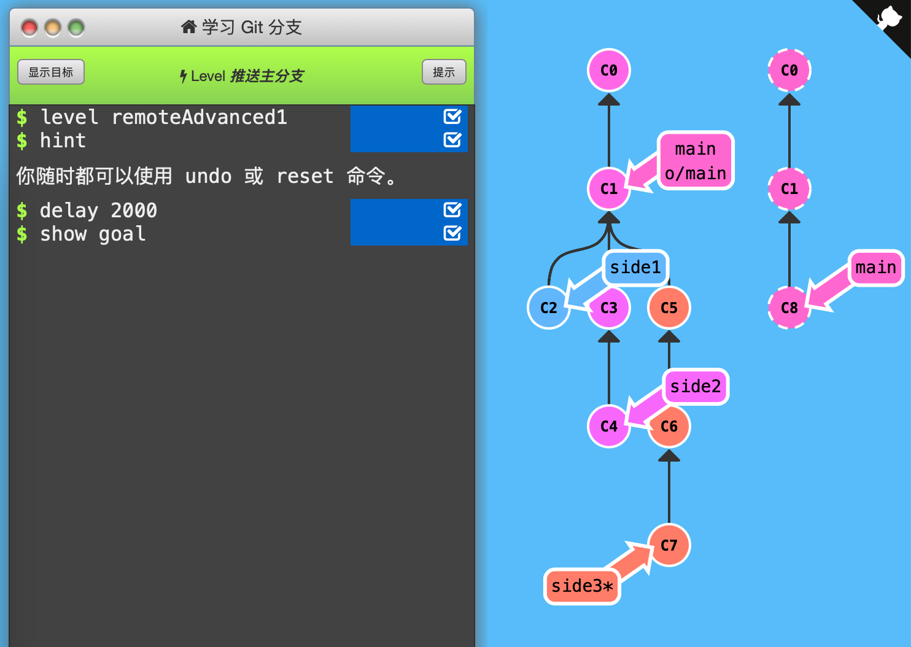

   

   先`git fetch`抓取远程最新版本C8到C1底下，此时o/main指向C8。然后依次`git rebase branch1 branch2`将side1加到o/main下、将side2加到side1下、将side3加到side2下、将main指向side3指向的C7。最后`git push`推送到远程仓库。

   

   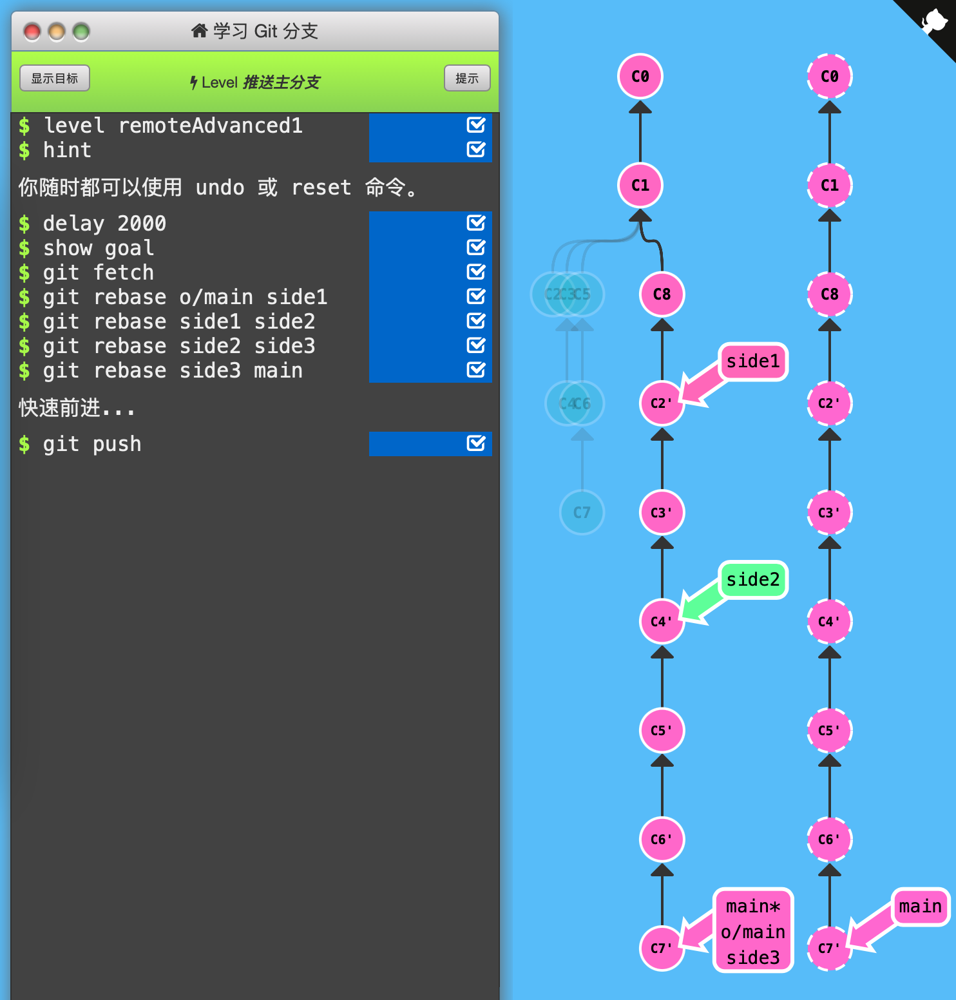

   

2. 合并远程仓库

3. 远程追踪

4. Git push的参数

5. Git push 参数 2

6. Git fetch 的参数

7. 没有source的source

8. Git pull 的参数

Created On : 2023-04-12
Last Modified : 2023-04-19