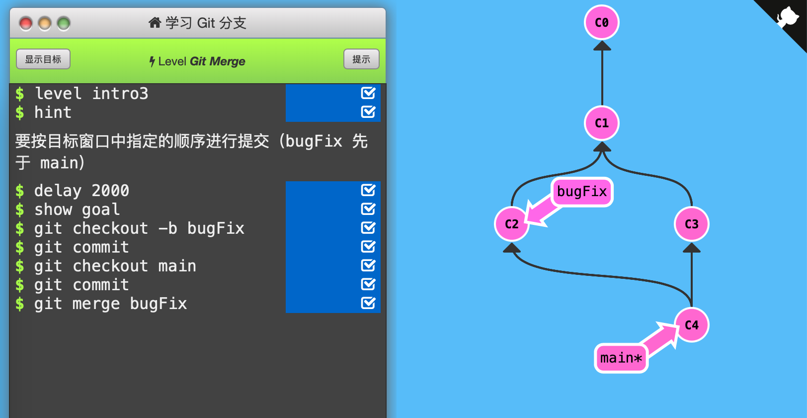
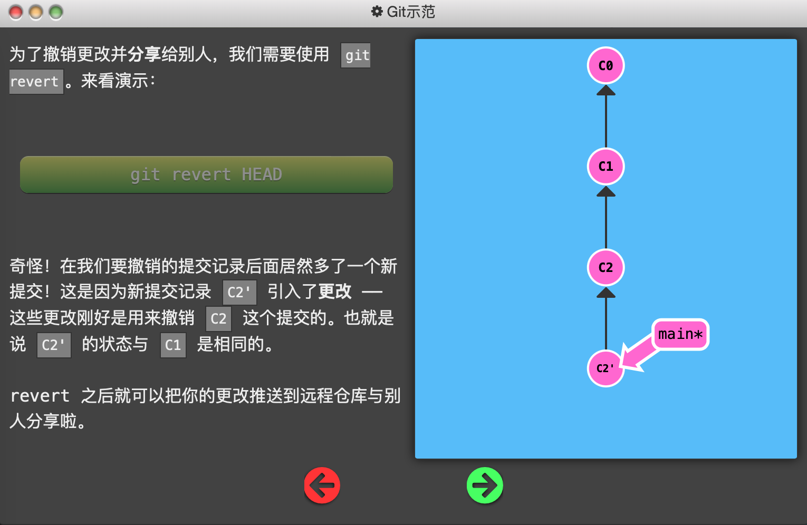

## Learning Git Branch通关指南（[链接](https://learngitbranching.js.org)）

# 基础篇

1. Git Commit

   「提交」保存目录下所有文件快照，「提交记录」可以看作整个项目的快照（轻量级，非全盘复制）

   

   每次「提交」时只把所有的差异打包到一起作为一个「提交记录」

   

   Git 还保存了提交的历史记录，因此每个「提交记录」（图中的一个节点）上都有父节点

   

   修改代码库后，使用`git commit`，在当前所处的「提交记录」下创建新的「提交记录」（向下生成一个子节点），并移动到该节点上。

   

   通关记录：（初始状态：C0，C1（main*））

   

   

   

2. Git Branch

   Git的「分支」指向某个提交记录。

   

   「分支」非常轻量，创建再多的分支也不会造成储存或内存上的开销，并且按逻辑分解工作到不同的分支要比维护那些特别臃肿的分支简单多了。

   

   因此提倡「早建分支！多用分支！」

   

   使用「分支」相当于“基于这个提交以及它所有的父提交进行新的工作”。

   

   使用`git branch branch_name`创建新分支，但默认还在原来main分支上，此时commit会使main分支前进，新分支待在原地。

   

   使用`git checkout branch_name`切换到新分支上。（新版本Git使用git switch代替git checkout）

   

   创建新分支的同时切换到新分支上：`git checkout -b branch_name`

   

   通关记录：（初始状态：C0，C1（main*））

   

   

   

3. Git Merge

   创建新分支，在其上开发某个新功能，开发完成后再合并回主线。

   

   使用`git merge branch_name`（其中branch_name是要合并到当前分支的分支名）「合并」两个分支。

   

   此时会产生一个特殊的提交记录，它有两个父节点。相当于“把这两个父节点本身及它们所有的祖先都包含进来。”

   

   

   

   如果要「合并」的分支是当前分支的父节点，Git 什么都不用做，只是把那个分支移动到当前分支所指的提交记录上。

   

   

   

   通关记录：（初始状态：C0，C1（main*））

   

   

   

   

4. Git Rebase

   Rebase是另一个合并分支的方法：取出一系列的提交记录，“复制”它们，然后在另外一个地方逐个的放下去。

   

   Rebase 的优势就是可以创造更「线性」的提交历史。

   

   使用`git rebase branch_name`（其中branch_name是当前分支要合并“去”的分支名）「合并」两个分支。

   

   此时当前分支原来所在的提交记录依然存在（C3），但当前分支已经移动到rebase的分支（main）的子节点去了。然而rebase的分支还没有更新。

   

   

   

   如果要「rebase」的分支是当前分支的子节点，Git 什么都不用做，只是把当前分支移动到那个分支所指的提交记录上。

   

   

   通关记录：（初始状态：C0，C1（main*））

   

   

   

# 高级篇

1. 分离HEAD

   「HEAD」 是一个对当前所在分支的符号引用。「HEAD」总是指向当前分支上最近一次提交记录。

   

   「HEAD」 通常情况下是指向分支名的（如 bugFix）。在你提交时，改变了 bugFix 的状态，这一变化通过 「HEAD」 变得可见。

   

   「分离的 HEAD」 就是让其指向了某个具体的提交记录而不是分支名。

   

   注：图中C1、C2等是提交记录的哈希值，现实中不会这么简洁地呈现。但`git checkout <hash_code>`命令确实有用。

   

   

   

   我的理解：HEAD是Git中一个重要的指针，它可以指向分支名（而分支名指向一个提交记录），也可以指向提交记录。通常图中的\*号就表示当前HEAD所指的分支名，没有\*号则HEAD必然指向某个提交记录。也可以理解成：HEAD是隐藏分支名，如果不分离，则与另一个分支名重合。

   

   通关记录：（初始状态：当前所在分支为bugFix（后面有*号），HEAD没有显示出来）

   

   

   

2. 相对引用（^）

   如上一节所说，C1、C2等是提交记录的「哈希值」，现实中的「哈希值」可能是：

   `fed2da64c0efc5293610bdd892f82a58e8cbc5d8`

   

   提交记录的「哈希值」可以使用`git log`命令查看。

   

   但是，Git 对哈希值的处理很智能。只需要提供能够唯一标识提交记录的前几个字符即可。如`fed2`即可识别上面的哈希值。

   

   使用「哈希值」指定提交记录很不方便。因此使用相对引用：

   - 使用 `^` 向上移动 1 个提交记录
   - 使用 `~<num>` 向上移动多个提交记录，如 `~3`

   将上面的符号加在「引用名称」的后面，来寻找提交记录的祖先节点。

   

   

   

   

   

   通关记录：（初始状态：*号在main后面，HEAD没有显示）

   

   

   

   

3. 相对引用2（~）

   - 如上一节所说，使用 `~<num>` 可以向上移动多个提交记录。

   

   - 强制修改分支位置：直接使用 `-f` 选项让分支（而不必是HEAD）指向另一个提交。（下图中，初始时main指向C4）

   

   

   通关记录：（初始状态：main指向C4，bugFix指向C5，HEAD指向C2）

   

   依次使用「强制修改分支位置」移动main和bugFix、使用「~相对引用」移动HEAD

   

   

   

4. 撤销变更

   - 使用`git reset`命令向上移动分支，实现「改写历史」。

   

   - 使用`git revert`命令将撤销后指向的提交记录生成新的提交记录，添加在当前分支上。这样可以将「撤销更改」推送到远程仓库。

   

   

   通关记录：（初始状态：local*指向C3，pushed指向C2）

   

   依次使用`git reset`撤销「HEAD所指」的local分支，使之指向C1；使用`git checkout`将HEAD指向pushed分支；使用`git revert`撤销pushed分支，生成与C1内容相同的C2'提交记录。（注意，revert前先分离HEAD至pushed，才能在C2下面生成新提交记录）

   

   

   

# 移动提交记录

1. Git Cherry-pick
2. 交互式rebase

# 杂项

1. 只取一个提交记录
2. 提交的技巧 #1
3. 提交的技巧 #2
4. Git Tag
5. Git Describe

# 高级话题

1. 多次Rebase
2. 两个父节点
3. 纠缠不清的分支

# Push & Pull —— Git远程仓库

1. Git Clone
2. 远程分支
3. Git Fetch
4. Git Pull
5. 模拟团队合作
6. Git Push
7. 偏离的提交历史
8. 锁定的Main（Locked Main）

# 关于Origin和它的周边——Git远程仓库高级操作

1. 推送主分支
2. 合并远程仓库
3. 远程追踪
4. Git push的参数
5. Git push 参数 2
6. Git fetch 的参数
7. 没有source的source
8. Git pull 的参数

Created On : 2023-04-12
Last Modified : 2023-04-12