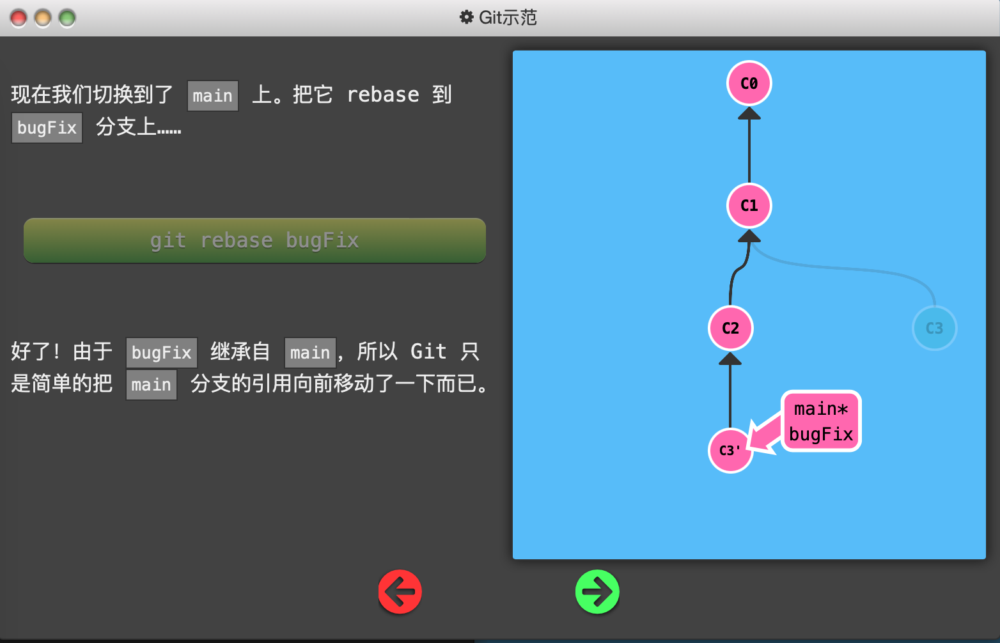
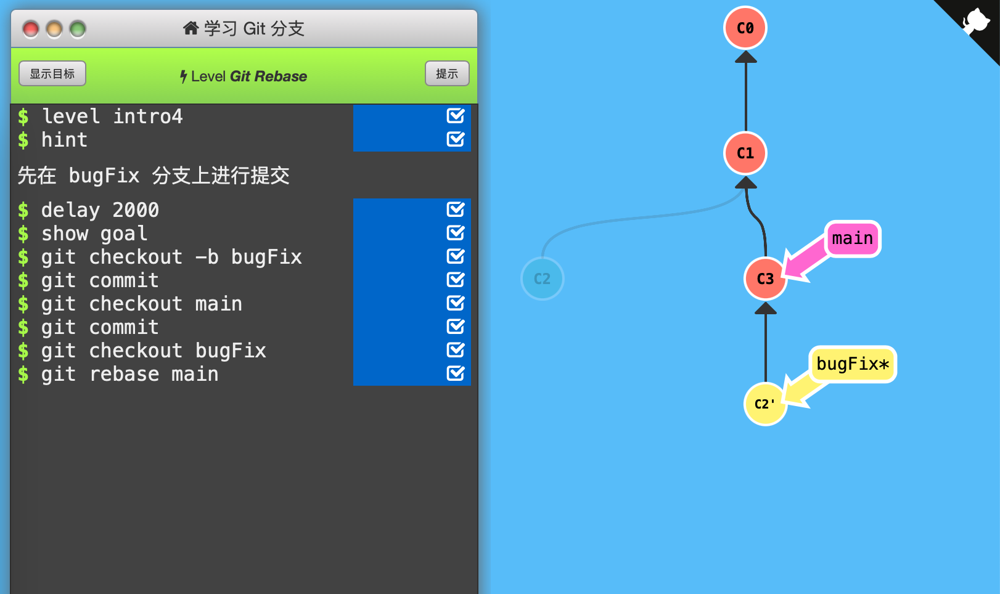
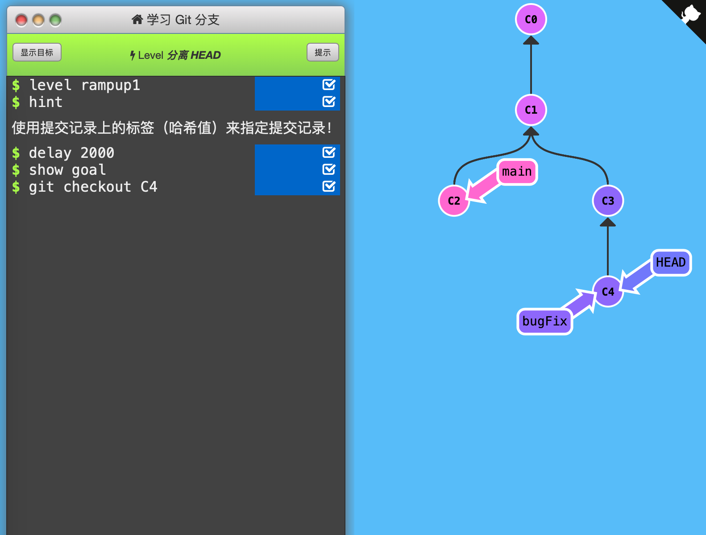
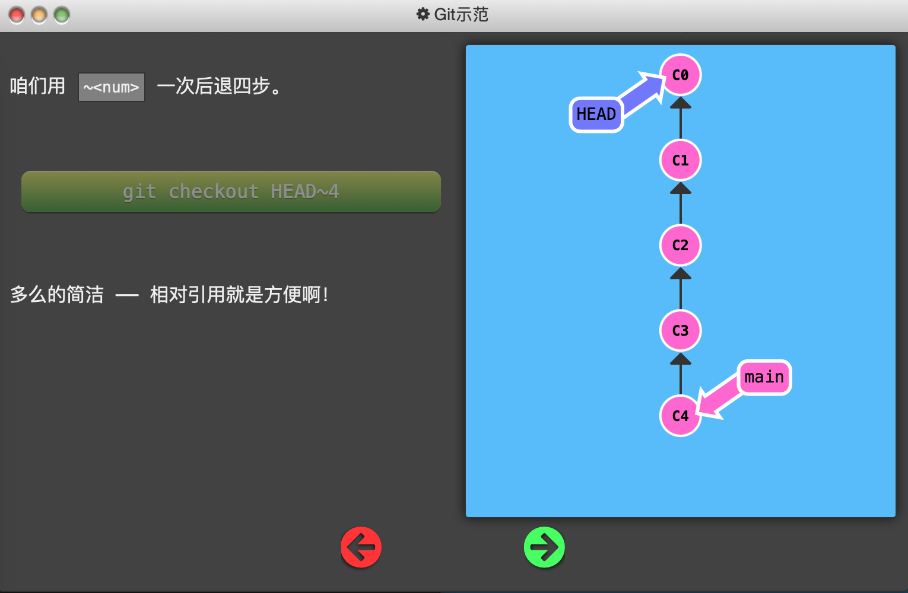
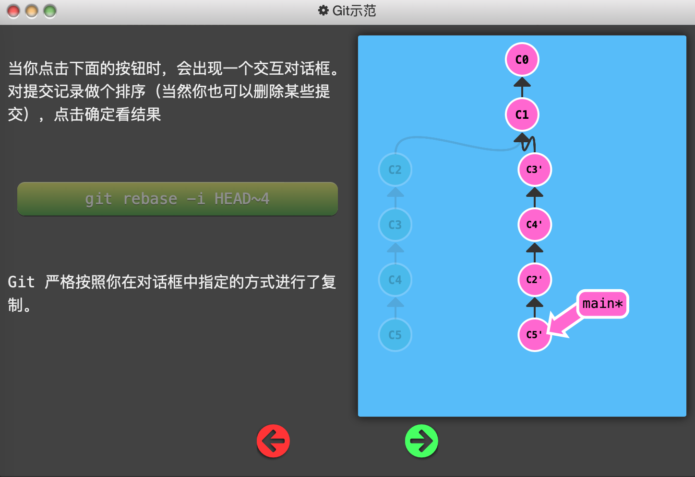
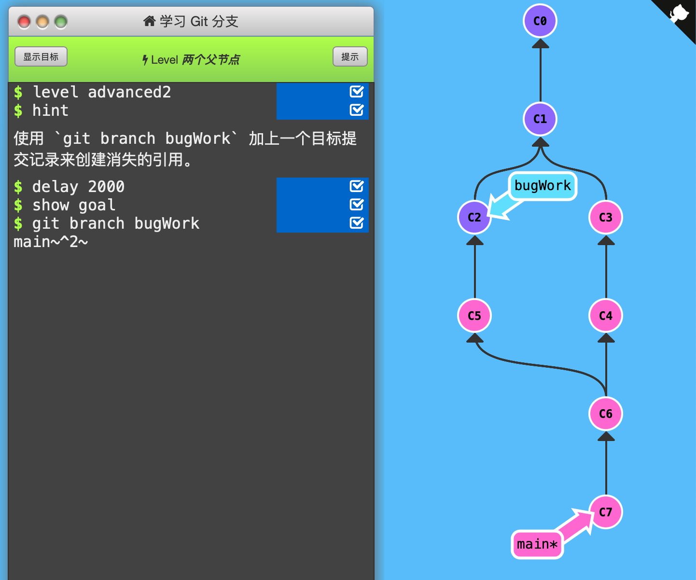

## Learning Git Branch通关指南（[链接](https://learngitbranching.js.org)）

# 基础篇

1. Git Commit

   「提交」保存目录下所有文件快照，「提交记录」可以看作整个项目的快照（轻量级，非全盘复制）

   

   每次「提交」时只把所有的差异打包到一起作为一个「提交记录」

   

   Git 还保存了提交的历史记录，因此每个「提交记录」（图中的一个节点）上都有父节点

   

   修改代码库后，使用`git commit`，在当前所处的「提交记录」下创建新的「提交记录」（向下生成一个子节点），并移动到该节点上。

   

   通关记录：（初始状态：C0，C1（main*））

   

   

   

2. Git Branch

   Git的「分支」指向某个提交记录。

   

   「分支」非常轻量，创建再多的分支也不会造成储存或内存上的开销，并且按逻辑分解工作到不同的分支要比维护那些特别臃肿的分支简单多了。

   

   因此提倡「早建分支！多用分支！」

   

   使用「分支」相当于“基于这个提交以及它所有的父提交进行新的工作”。

   

   使用`git branch branch_name`创建新分支，但默认HEAD还在原来main分支上，此时commit会使main分支前进，新分支待在原地。

   

   使用`git checkout branch_name`切换到新分支上。（新版本Git使用git switch代替git checkout）

   

   创建新分支的同时切换到新分支上：`git checkout -b branch_name`

   

   通关记录：（初始状态：C0，C1（main*））

   

   

   

3. Git Merge

   创建新分支，在其上开发某个新功能，开发完成后再合并回主线。

   

   使用`git merge branch_name`（其中branch_name是要合并到当前分支的分支名）「合并」两个分支。

   

   此时会产生一个特殊的提交记录，它有两个父节点。相当于“把这两个父节点本身及它们所有的祖先都包含进来。”

   

   

   

   如果要「合并」的分支是当前分支的父节点，Git 什么都不用做，只是把那个分支移动到当前分支所指的提交记录上。

   

   

   

   通关记录：（初始状态：C0，C1（main*））

   

   

   

   

4. Git Rebase

   Rebase是另一个合并分支的方法：取出一系列的提交记录，“复制”它们，然后在另外一个地方逐个的放下去。

   

   Rebase 的优势就是可以创造更「线性」的提交历史。

   

   使用`git rebase branch_name`（其中branch_name是当前分支要合并“去”的分支名）「合并」两个分支。

   

   此时当前分支原来所在的提交记录依然存在（C3），但当前分支已经移动到rebase的分支（main）的子节点去了。然而rebase的分支还没有更新。

   

   如果有多个分支，则创建新提交记录接在下面；如果分支已经是最新版本，则是将分支指向目标提交记录。

   

   

   

   如果要「rebase」的分支是当前分支的子节点，Git 什么都不用做，只是把当前分支移动到那个分支所指的提交记录上。

   

   

   通关记录：（初始状态：C0，C1（main*））

   
   
   
   
   

# 高级篇

1. 分离HEAD

   「HEAD」 是一个对当前所在分支的符号引用。「HEAD」总是指向当前分支上最近一次提交记录。

   

   「HEAD」 通常情况下是指向分支名的（如 bugFix）。在你提交时，改变了 bugFix 的状态，这一变化通过 「HEAD」 变得可见。

   

   「分离的 HEAD」 就是让其指向了某个具体的提交记录而不是分支名。

   

   注：图中C1、C2等是提交记录的哈希值，现实中不会这么简洁地呈现。但`git checkout <hash_code>`命令确实有用。

   

   

   

   我的理解：HEAD是Git中一个重要的指针，它可以指向分支名（而分支名指向一个提交记录），也可以指向提交记录。通常图中的\*号就表示当前HEAD所指的分支名，没有\*号则HEAD必然指向某个提交记录。也可以理解成：HEAD是隐藏分支名，如果不分离，则与另一个分支名重合。

   

   通关记录：（初始状态：当前所在分支为bugFix（后面有*号），HEAD没有显示出来）

   

   

   

2. 相对引用（^）

   如上一节所说，C1、C2等是提交记录的「哈希值」，现实中的「哈希值」可能是：

   `fed2da64c0efc5293610bdd892f82a58e8cbc5d8`

   

   提交记录的「哈希值」可以使用`git log`命令查看。

   

   但是，Git 对哈希值的处理很智能。只需要提供能够唯一标识提交记录的前几个字符即可。如`fed2`即可识别上面的哈希值。

   

   使用「哈希值」指定提交记录很不方便。因此使用相对引用：

   - 使用 `^` 向上移动 1 个提交记录
   - 使用 `~<num>` 向上移动多个提交记录，如 `~3`

   将上面的符号加在「引用名称」的后面，来寻找提交记录的祖先节点。

   

   

   

   

   

   通关记录：（初始状态：*号在main后面，HEAD没有显示）

   

   

   

   

3. 相对引用2（~）

   - 如上一节所说，使用 `~<num>` 可以向上移动多个提交记录。

   

   - 强制修改分支位置：直接使用 `-f` 选项让分支（而不必是HEAD）指向另一个提交。（下图中，初始时main指向C4）

   

   

   通关记录：（初始状态：main指向C4，bugFix指向C5，HEAD指向C2）

   

   依次使用「强制修改分支位置」移动main和bugFix、使用「~相对引用」移动HEAD

   

   

   

4. 撤销变更

   - 使用`git reset`命令向上移动分支，实现「改写历史」。

   

   - 使用`git revert`命令将撤销后指向的提交记录生成新的提交记录，添加在当前分支上。这样可以将「撤销更改」推送到远程仓库。

   

   

   通关记录：（初始状态：local*指向C3，pushed指向C2）

   

   依次使用`git reset`撤销「HEAD所指」的local分支，使之指向C1；使用`git checkout`将HEAD指向pushed分支；使用`git revert`撤销pushed分支，生成与C1内容相同的C2'提交记录。（注意，revert前先分离HEAD至pushed，才能在C2下面生成新提交记录）

   

   

   

# 移动提交记录

1. Git Cherry-pick

   本节内容讲如何「整理提交记录」，即操控之前那些节点。

   

   `git cherry-pick <提交号>...`命令将一些提交「复制」到当前所在位置「HEAD」的下面。

   

   下图初始状态：C2'和C4'都没有，main*指向C5。

   

   

   

   对比`git rebase <branch_name>`命令，rebase是将当前所在位置复制一份，并加到到目标分支下面，且当前所在位置移动过去了。而`git cherry-pick`仅仅复制了「提交记录」到当前所在位置的下面，并移动了HEAD到最新提交记录。

   

   通关记录：（初始状态：main*指向C1，C3'、C4'、C7'不存在）

   

   用`git cherry-pick`将3个提交记录复制添加到main*下面即可。注意该命令后可跟多个提交记录，会依次按顺序添加。

   

   

   

2. 交互式rebase

   `git cherry-pick`虽然好用，但如果不知道提交记录的哈希值，就不那么方便了。因此需要使用交互式rebase从一系列的提交记录中找到想要的记录。

   

   交互式rebase即使用带参数 `--interactive` 的 rebase 命令, 简写为 `-i`。Git 会打开一个 UI 界面（一般是Vim）并列出将要被复制到目标分支的备选提交记录，它还会显示每个提交记录的哈希值和提交说明。

   

   下图初始状态：main*指向C5，右边这一列带'的提交记录都不存在。在课程给出的面板中可以调整C2\~C5节点的顺序、是否加入，最后会按照该顺序rebase到HEAD\~4即C1下面。

   

   

   

   通关记录：（初始状态：和上面的初始状态一样。）

   

   使用`git rebase -i HEAD~4`进入交互式rebase界面，并指定rebase的目标节点为C1。然后根据要求调整节点数量和顺序为C3、C5、C4即可。

   

   

   
   
   

# 杂项

1. 只取一个提交记录

   通关记录：（初始状态：C1 main，C2 debug，C3 printf， C4 bugFix\*，本关只检查main\*的位置）

   

   法1:HEAD转移到main上，再用cherry-pick把bugFix复制到main*下。

   

   

   

   法2:交互式rebase将bugFix到main的C2~C4三个提交记录指定只保留C4，并接在main下面，再用rebase将main移动到bugFix并指定为HEAD所在处。

   

   

   

2. 提交的技巧 #1

   本节解决一种情况：希望在某个分支的旧版本上作修改，如有C1-C2-C3，希望修改C2，又要保留C3的修改。

   

   方法：`git rebase -i`重新排序提交记录，把希望修改的提交记录放在最前面用`git commit --amend`修改（这样新的提交记录是平行的，而不是在下面新添加），再用`git rebase -i`排序回来，最后把main分支移动到最新版本。

   

   通关记录：（初始状态：C1 main，C2 newImage，C3 caption，本关只检查main\*的位置）

   

   思路：

   首先`git rebase -i HEAD~2`，交换C2、C3位置，作为新提交记录添加在C1下面，此时caption*指向C2'；

   然后`git commit --amend`平行增加新提交记录C2''；再`git rebase -i HEAD~2`交换回C2、C3位置；

   接着`git checkout main`+`git rebase caption`把main分支前进到最新版本。

   

   

   

3. 提交的技巧 #2

   还是上面一节的问题，这次用cherry-pick解决。

   

   通关记录：（初始状态：C1 main，C2 newImage，C3 caption）

   

   思路：

   先把HEAD移动到main上；

   然后`git cherry-pick C2`取出非最新版的提交记录C2，接在main*下面；

   接着`git commit --amend`修改C2'并与其平行放置；

   最后`git cherry-pick C2`取回C2后面的修改C3 caption，接在修改完毕的C2''下面。

   

   

   

4. Git Tag

   Git的tag可以永久地将某个特定的提交命名为里程碑，然后就可以像分支一样引用了。

   

   它们并不会随着新的提交而移动。你也不能切换到某个标签上面进行修改提交，它就像是提交树上的一个锚点，标识了某个特定的位置。

   

   具体用法：`git tag v1 C1`，将标签v1贴在提交记录C1上，如果不指定提交记录，则使用HEAD所指向的位置。

   

   通关记录：（初始状态：节点无变化，各个分支指向为：C3 side，C5 main*）

   

   按照目标增添2个tag、分离HEAD到v1所在提交记录即可。

   

   

   

5. Git Describe

   Git Describe 能帮你在提交历史中移动了多次以后找到方向。

   

   用法：`git describe <ref>`，ref是任何提交记录的引用（哈希值、分支名、tag），不指定则默认为HEAD所在位置。

   

   输出：	`<tag>_<numCommits>_g<hash>`，tag是离ref最近的标签，numCommits是ref和tag相差多少个提交记录，hash表示ref的哈希值的前几位。如果ref上有标签，则只输出标签。

   

   

   

   通关记录：本关是体验关，只要在bugFix上commit一下即可过。

   

   4条语句分别测试了：

   默认describe的是HEAD所在提交记录；

   指定提交记录的哈希值；

   指定提交记录的tag；

   指定提交记录的分支名称；

   指定的提交记录如果有tag，输出tag；

   指定的提交记录没有tag，输出`<tag>_<numCommits>_g<hash>`。

   

   

# 高级话题

1. 多次Rebase

   通关记录：（初始状态：带'的节点都不存在；C2 main*，C3 bugFix，C6 side，C7 another）

   

   注意：`git rebase branch1 branch2`会将branch2到两个分支最近公共父节点之间的分支提交记录都复制并移动到branch1下，且HEAD移动到新节点上。

   

   如果两个分支的公共父节点相同（都在一个分支上，如最后的main 和another），则是将branch2指向branch1的节点，且HEAD指向branch2。

   

   

   

2. 两个父节点

   前面讲的merge会创建拥有两个父节点的新节点。因此，当在分支树中移动时需要注意移动到哪个父节点那边。^+数字可以指定移动到第几个父节点。

   

   下面的例子中，通过checkout不断移动HEAD。HEAD~n表示向上移动n次（没有n则1次），HEAD^2表示移动到第二个父节点（移动1次而不是2次）。因此，这段代码使得HEAD的移动路径为：C7-C6-C5-C3。

   

   另外，这段代码可以简写成：`git checkout HEAD~^2~2`。效果一样。

   

   

   

   通关记录：（初始状态：bugWork不存在）

   

   

   

3. 纠缠不清的分支

   通关记录：（初始状态：带'的全都不存在；C1 one two three， C5 main*）

   

   

# Push & Pull —— Git远程仓库

1. Git Clone
2. 远程分支
3. Git Fetch
4. Git Pull
5. 模拟团队合作
6. Git Push
7. 偏离的提交历史
8. 锁定的Main（Locked Main）

# 关于Origin和它的周边——Git远程仓库高级操作

1. 推送主分支
2. 合并远程仓库
3. 远程追踪
4. Git push的参数
5. Git push 参数 2
6. Git fetch 的参数
7. 没有source的source
8. Git pull 的参数

Created On : 2023-04-12
Last Modified : 2023-04-17