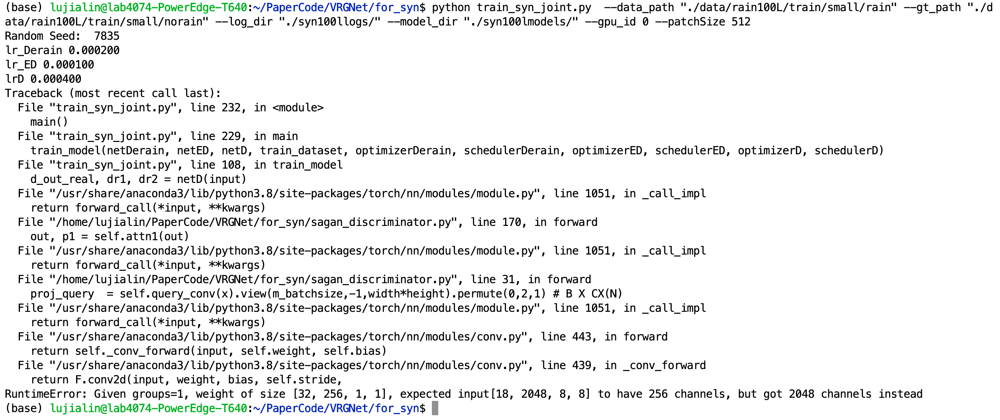

## VRGNet修改图像尺寸为512*512，运行时出现Attention部分通道数不匹配


**错误提示**：



---

**分析**：
Attention代码：
```
class Self_Attn(nn.Module):
    """ Self attention Layer"""

    def __init__(self, in_dim, activation):
        super(Self_Attn, self).__init__()

        # 初始化输入通道数、激活函数
        self.chanel_in = in_dim
        self.activation = activation

        # 定义三个卷积层
        # query_conv 用于提取query
        # key_conv 用于提取key
        # value_conv 用于提取value
        self.query_conv = nn.Conv2d(
            in_channels=in_dim, out_channels=in_dim//8, kernel_size=1)
        self.key_conv = nn.Conv2d(
            in_channels=in_dim, out_channels=in_dim//8, kernel_size=1)
        self.value_conv = nn.Conv2d(
            in_channels=in_dim, out_channels=in_dim, kernel_size=1)

        # gamma是一个可学习的参数，用于调节输出的大小
        self.gamma = nn.Parameter(torch.zeros(1))

        self.softmax = nn.Softmax(dim=-1)

    def forward(self, x):
        """
            inputs :
                x : input feature maps( B X C X W X H)
            returns :
                out : self attention value + input feature 
                attention: B X N X N (N is Width*Height)
        """
        # x.size() = (batch_size, channel, height, width)
        m_batchsize, C, width, height = x.size()
        # proj_query 用于提取query
        # proj_key 用于提取key
        proj_query = self.query_conv(x).view(  # error
            m_batchsize, -1, width*height).permute(0, 2, 1)  # B X CX(N)
        proj_key = self.key_conv(x).view(
            m_batchsize, -1, width*height)  # B X C x (*W*H)
        # 使用矩阵乘法计算注意力
        energy = torch.bmm(proj_query, proj_key)  # transpose check
        # 计算softmax
        attention = self.softmax(energy)  # BX (N) X (N)
        # proj_value 用于提取value
        proj_value = self.value_conv(x).view(
            m_batchsize, -1, width*height)  # B X C X N

        # 计算注意力权重
        out = torch.bmm(proj_value, attention.permute(0, 2, 1))
        out = out.view(m_batchsize, C, width, height)

        # 将注意力权重和输入特征叠加
        out = self.gamma*out + x
        return out, attention
```

根据报错信息，输入的通道数是预期的8倍，推测是图像尺寸从64\*64变到512\*512时，通道数增大8倍导致的。

---

**解决**：

Discriminator定义Attention层部分：
```
# 注意力机制
self.attn1 = Self_Attn(256, 'relu')
self.attn2 = Self_Attn(512, 'relu')
```
指定输入通道数匹配512*512的版本，即扩大8倍。
```
# 注意力机制
self.attn1 = Self_Attn(256 * 8, 'relu')
self.attn2 = Self_Attn(512 * 8, 'relu')
```


Created On : 2023-04-02
Last Modified : 2023-04-02