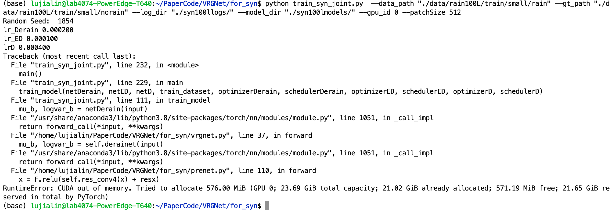

## 跑深度学习代码报错：CUDA显存不足，且不管怎么调小batch_size都不行

**错误提示**：

---

**分析**：

此问题出现在将VRGNet修改为输出512*512尺寸图像时。

修改包括以下方面：
1. Discriminator 加了3层 
2. Encoder, Decoder各加了3层
3. 数据加载直接上采样到了512

已修改文件：sagan_discriminator.py，vrgnet.py，DerainDataset.py

增加了很多参数量，猜想模型过大，显存不足。且与batch_size无关。(batch_size=1时，也会报错)

---

**解决**：

尝试减少模型参数量。目前VRGNet的修改还在进行中

Created On : 2023-04-02
Last Modified : 2023-04-02