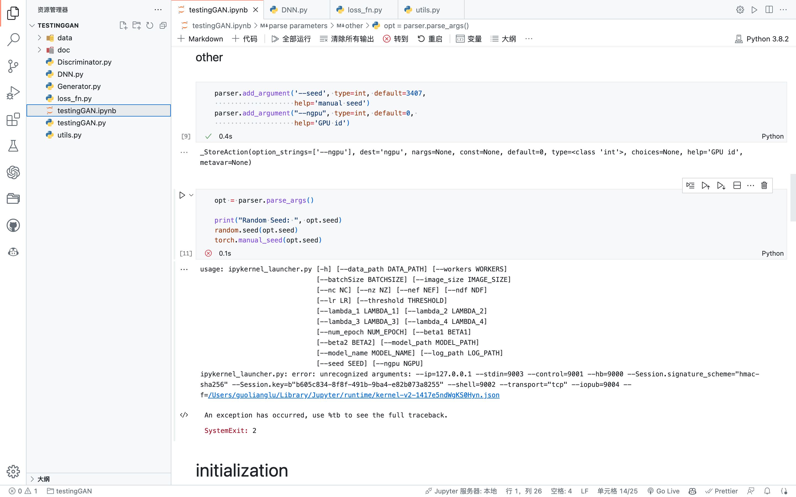

## 读取.pt模型文件时，提示读取压缩文件失败。


**错误提示**：



---

**分析**：
ipynb文件运行时会传进去默认参数，因此有报错信息

> Error: unrecognized arguments: --ip=127.0.0.1...

因此手动指定命令行参数。

---

**解决**：

因为参数都有默认值，在ipynb中运行时不指定参数也行，所以传进去args=[]。这样等价于 `python file.py`，如果希望传参数，也可以改成`opt = parser.parse_args(args=['--device', '0',  '--no_cuda'])`这样。

```python
# opt = parser.parse_args()

# jupyter notebook中硬编码参数
opt = parser.parse_args(args=[])
```


Created On : 2023-05-25
Last Modified : 2023-05-25