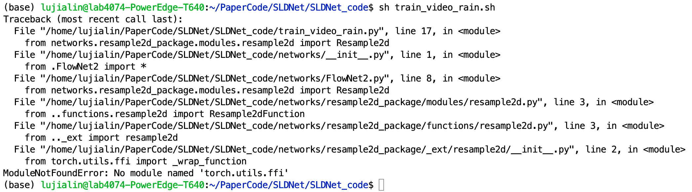

## 跑


**错误提示**：



---

**分析**：

torch版本太新了，torch.utils.ffi早就deprecated了。

有时候可以类似于之前的Unity有个包发布的时候用不了，改用别的相同作用的包。

但SLDNet导入的是_wrap_function，就不能这样解决，只能回退torch版本。

---

**解决**：

有时候可以通过用其他包（如create_extension）替代来解决：（参考[链接](https://blog.csdn.net/ShuqiaoS/article/details/88420326)）

原代码：

```
from torch.utils.ffi import create_extension

# 调用
ffi = create_extension(...)
```

改成：

```
from torch.utils.cpp_extension import BuildExtension

# 调用
ffi = BuildExtension(...)
```

对于SLDNet，需要用conda创建torch=0.4.1的环境（服务器是python 3.10.10，torch 2.0.0，版本高的吓人）

现在还在摸索中......


Created On : 2023-04-22
Last Modified : 2023-04-22