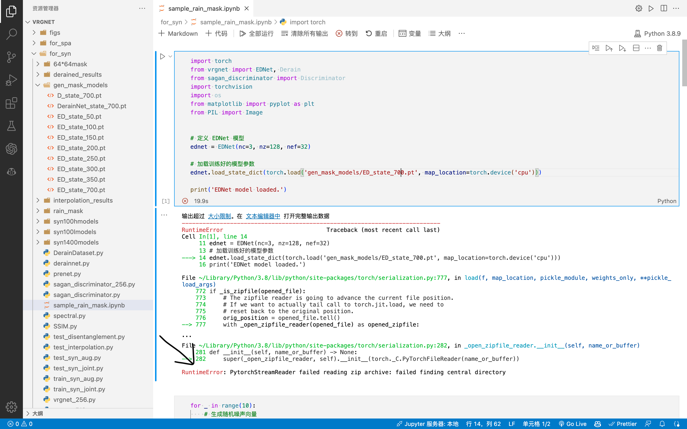
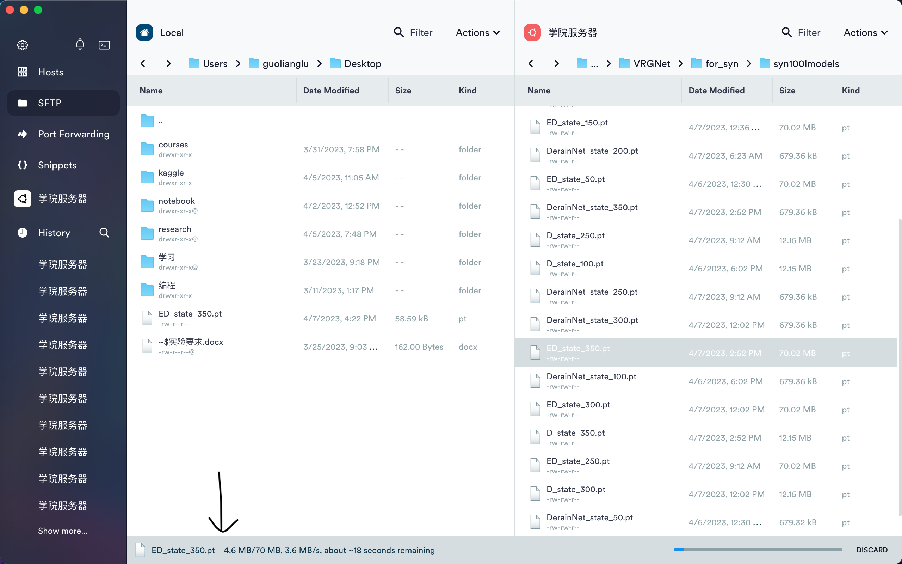

## 读取.pt模型文件时，提示读取压缩文件失败。

**错误提示**：

---

**分析**：
根据错误提示，文件读取器无法读取压缩文件。但这显然不是压缩文件，唯一解释是文件损坏或格式不正确。

---

**解决**：
注意到Terminus（以及任何远程终端软件）传输文件时有进度条，而Terminus的进度条及其不显眼。对于VRGNet的ED网络，我修改其架构使之适配512*512高分辨率图片后参数量激增，模型文件达到70M，传输需要一定时间，而传输过程中关闭Terminus等操作导致传输的文件不完整。

Created On : 2023-04-07
Last Modified : 2023-04-07