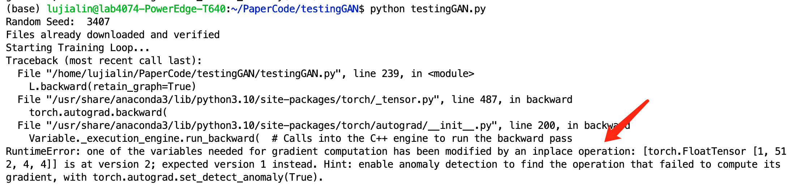

## 更新不同网络时使用同一项损失函数，因计算图重复报错“原位操作”。


**错误提示**：



---

**分析**：
原代码：

```python
# optimizer梯度清零
optimizerD.zero_grad()
optimizerG.zero_grad()

# 计算L_D，更新D
L_D = calc_L_D(X, X_, netD, criterion, real_label, fake_label, device)
L_D.backward(retain_graph=True)
optimizerD.step()

# 计算L，其中包含L_D，更新G
L = L_D + opt.lambda_1 * L_hinge + opt.lambda_2 * L_gini + opt.lambda_3 * L_neu
L.backward()
optimizerG.step()
```

对于L_D这一项，后面的计算是在原来的计算图的原位上进行计算。


---

**解决**：

显式分离计算图：

```python
# optimizer梯度清零
optimizerD.zero_grad()
optimizerG.zero_grad()

# 计算L_D，更新D
L_D = calc_L_D(X, X_, netD, criterion, real_label, fake_label, device)
L_D.backward(retain_graph=True)
optimizerD.step()

# 显式分离计算图
L_D_detached = L_D.detach()

# 计算L，其中包含L_D，更新G
L = L_D_detached + opt.lambda_1 * L_hinge + opt.lambda_2 * L_gini + opt.lambda_3 * L_neu
L.backward()
optimizerG.step()
```

这样计算 `L` 的梯度时，使用了分离后的 `L_D_detached`，这样就避免了在第二次反向传播中使用第一次反向传播的计算图

Created On : 2023-05-26
Last Modified : 2023-05-26