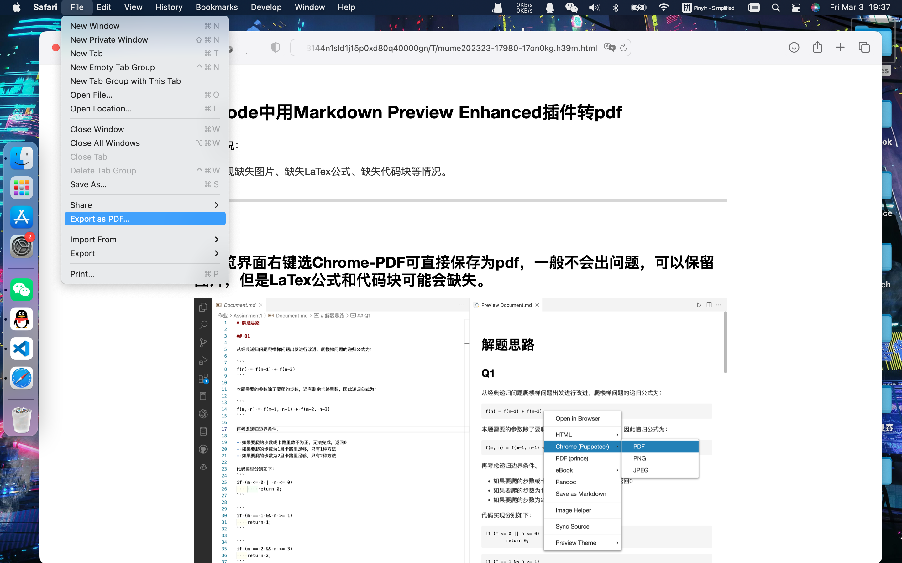

## VScode中用Markdown Preview Enhanced插件转pdf

**错误情况**：

可能出现缺失图片、缺失LaTex公式、缺失代码块等情况。

---

**解决**：

### 1.预览界面右键选Chrome-PDF可直接保存为pdf，一般不会出问题，可以保留图片，但是LaTex公式和代码块可能会缺失。

### 2.预览界面右键选在浏览器中打开，safari中选输出为PDF。一般不会缺失内容，但比较麻烦，需要手动保存。

Created On : 2023-03-3
Last Modified : 2023-03-3